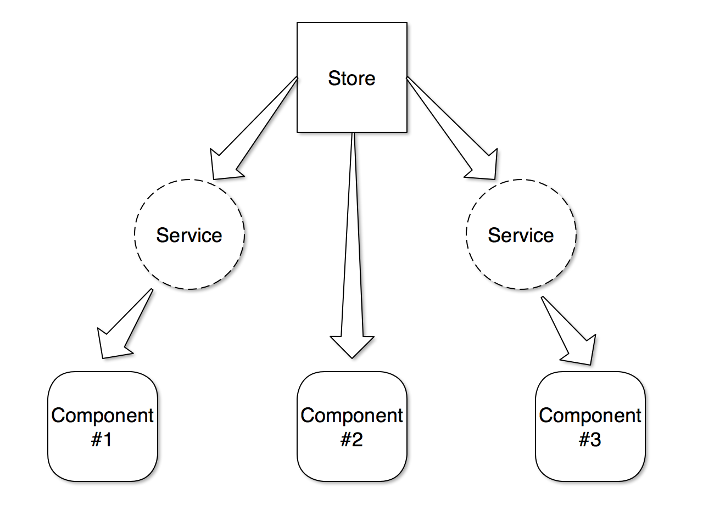
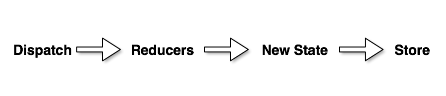
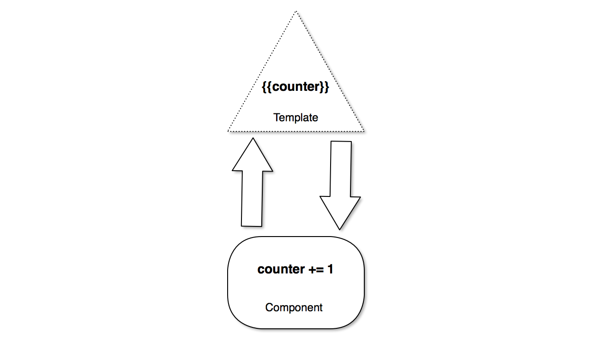
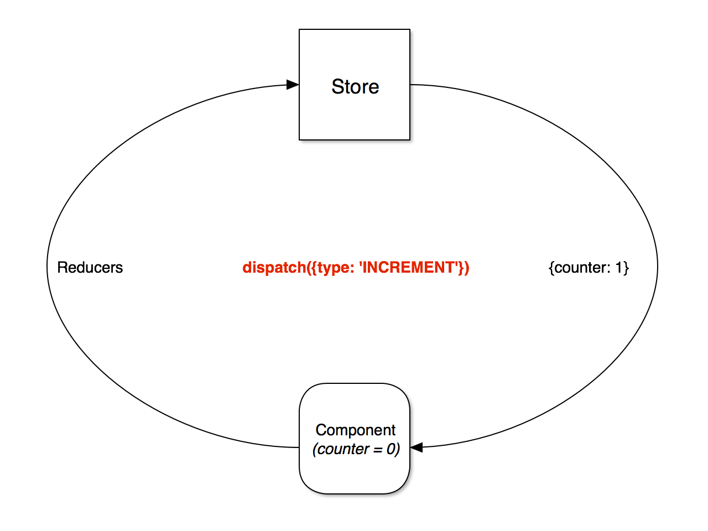
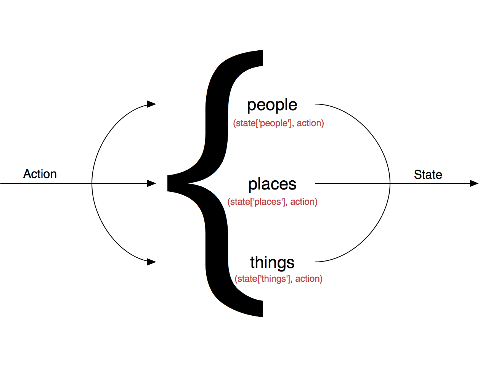
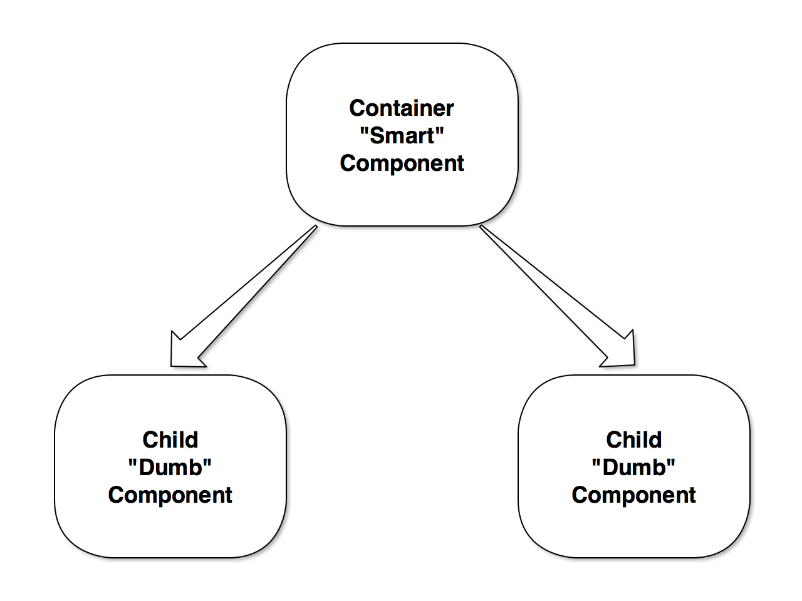

# Angular 2 how to not get stuck

----
Why Will Angular 2 Rock?

_( Source: http://angular-tips.com/blog/2015/06/why-will-angular-2-rock/ )_

_( This article has been update in January 30th. Now it is using TypeScript and angular 2.0.0-beta.2 )_

Angular 2 is around the corner and there are mixed opinions about it. Some people can’t wait for it and other people are not any happy with it. Why is that? People are afraid to change, thinking that they wasted their time learning something that is now going to change in a radical way.

Angular is a great framework, but it is 6 years old, and that for a framework is too much. The web evolved a lot since Angular inception in 2009 and the Angular team can’t simply implement those new stuff without breaking half of the actual implementation.

So if they have to break Angular to be able to make it “modern”, it is better to write it from scratch. How so? Angular itself has other problems like the complex syntax for directives, 5 types of services that confuses new users, writing stuff in the wrong scope…

They decided to kill 2 birds with one stone. A new simplified Angular with all the new stuff like shadow dom and also none of the Angular 1 problems.

So my friend, don’t worry, Angular 2 will rock.

// TODO - add what is new in angular

----

http://developer.telerik.com/featured/will-angular-2-take-off/

// TODO Sum up

----

https://webpack.github.io/docs/comparison.html

// TODO Sum up

----

## webpack2 vs rollup

_( Source: https://gist.github.com/forabi/2a538b263d0f1fe5f041 )_

the webpack2 bundle is that much smaller than the rollup bundle.

* *babel.client.js*
```js
const config = {
  presets: ['es2015', 'stage-3', 'react'],
  plugins: [
    'transform-object-rest-spread',
    'transform-function-bind',
    'transform-class-properties',
    'transform-decorators',
  ],
  sourceMaps: 'both',
};

if (process.NODE_ENV === 'production') {
  [
    'transform-react-constant-elements',
    'transform-react-inline-elements',
    'transform-node-env-inline',
    'remove-debugger',
    'remove-console',
  ].forEach(p => config.plugins.push(p));
  config.sourceMaps = false;
}

module.exports = config;
```


* *rollup.js*
```js
import babel from 'rollup-plugin-babel';
import nodeResolve from 'rollup-plugin-node-resolve';
import commonjs from 'rollup-plugin-commonjs';
const babelConfig = require('./babel.client');

babelConfig.presets[0] = 'es2015-rollup';

export default {
  entry: 'src/client.js',
  dest: 'src/public/bundle-rollup.js',
  plugins: [
    babel(Object.assign({
      exclude: 'node_modules/**',
      babelrc: false,
    }, babelConfig)),
    commonjs({
      include: 'node_modules/**',
      namedExports: {
        react: ['PropTypes'],
        'react-dom': ['render'],
      },
    }),
    nodeResolve({
      jsnext: false,
      main: true,
      browser: true,
    }),
  ],
  format: 'cjs',
};
```

* *Webpack 2.0.7-beta vs Rollup*
```
❯ rollup --version
rollup version 0.25.3

❯ time rollup -c ./rollup.js                      
rollup -c ./rollup.js  4.65s user 0.22s system 118% cpu 4.131 total

❯ time webpack                      
Hash: ebb00bbccd954c114d3c
Version: webpack 2.0.7-beta
Time: 3623ms
        Asset     Size  Chunks             Chunk Names
    bundle.js  1.44 MB       0  [emitted]  bundle
bundle.js.map  1.64 MB       0  [emitted]  bundle
    + 373 hidden modules
webpack  4.46s user 0.17s system 104% cpu 4.445 total

❯ du *.js -h
1.4M    bundle.js
1.8M    bundle-rollup.js


❯ time NODE_ENV='production' webpack
NODE_ENV='production' webpack  9.94s user 0.20s system 107% cpu 9.396 total

❯ time (NODE_ENV='production' rollup -c ./rollup.js && uglifyjs src/public/bundle-rollup.js --compress --mangle -o src/public/bundle-rollup.js)     
( NODE_ENV='production' rollup -c ./rollup.js && uglifyjs  --compress --mangl)  10.52s user 0.33s system 115% cpu 9.405 total

❯ du -h *.js
456K    bundle.js
876K    bundle-rollup.js
```

* *webpack.config.js*

```js
const path = require('path');
const webpack = require('webpack');
const babelConfig = require('./babel.client');

const config = {
  debug: true,

  devtool: 'source-map',

  entry: {
    bundle: './src/client.js',
  },

  output: {
    path: path.resolve(__dirname, 'src/public'),
    filename: '[name].js',
  },

  module: {
    loaders: [{
      test: /\.jsx?$/,
      exclude: /node_modules/,
      loader: 'babel',
      query: Object.assign(babelConfig, { cacheDirectory: './tmp' }),
    }],
  },
  plugins: [],
  resolve: { },
};

// Hot mode
if (process.env.HOT) {
  config.devtool = 'eval';
  config.entry.bundle.unshift('react-native-webpack-server/hot/entry');
  config.entry.bundle.unshift('webpack/hot/only-dev-server');
  config.entry.bundle.unshift('webpack-dev-server/client?http://localhost:8082');
  config.output.publicPath = 'http://localhost:8082/';
  config.plugins.unshift(new webpack.HotModuleReplacementPlugin());

  // Note: enabling React Transform and React Transform HMR:

  config.module.loaders[0].query.plugins.push('react-transform');
  config.module.loaders[0].query.extra = {
    'react-transform': [{
      target: 'react-transform-hmr',
      imports: ['react-native'],
      locals: ['module'],
    }],
  };
}

if (process.env.NODE_ENV === 'production') {
  config.devtool = false;
  config.debug = false;
  config.plugins.push(new webpack.optimize.OccurrenceOrderPlugin());
  config.plugins.push(new webpack.optimize.UglifyJsPlugin());
}

module.exports = config;
```

* **Conclusions:**
  * **First:** _Awesome, thanks a lot! I'm surprised that the webpack2 bundle is that much smaller than the rollup bundle._
  * **Aftwer a while:** _Just switched some personal small react apps over to webpack2 from rollup but there is practically no difference. :/_


---

webpack for large projects

_( Source: https://medium.com/@rajaraodv/webpack-the-confusing-parts-58712f8fcad9 )_

## Webpack’s Core Philosophy

Two core philosophies of Webpack are:

Everything is a module — Just like JS files can be “modules”, everything else (CSS, Images, HTML) can also be modules. That is, you can require(“myJSfile.js”) or require(“myCSSfile.css”). This mean we can split any artifact into smaller manageable pieces, reuse them and so on.

Load only “what” you need and “when” you need — Typically module bundlers take all the modules and generate a large single output “bundle.js” file. But in many real-world apps, this “bundle.js” could be 10MB-15MB and could take forever to load! So Webpack has various features to split your code and generate multiple “bundle” files, and also load parts of the app asynchronously so that you just load what you need and when you need it.

OK, Let’s take a look at various “confusing” parts.

###  1. Development Vs Production

First thing to be aware of is that Webpack has tons of features. Some are for “Development-only”, some others are for “Production-only” and some are for both “Production-and-Development”.

> Note: You can click on the pictures to zoom and read.

![][webpack--dev-and-prod]
_A sample dev v/s prod Webpack files_

> Typically most projects use so many features that they usually have two large Webpack config files.

And to create bundles you’ll write scripts in the package.json like so:

```js
"scripts": {
  //npm run build to build production bundles
  "build": "webpack --config webpack.config.prod.js",
  //npm run dev to generate development bundles and run dev. server
  "dev": "webpack-dev-server"
}
```

### 2. webpack CLI Vs webpack-dev-server

It’s important to note that Webpack, the module bundler, provides two interfaces:

1. **Webpack CLI** tool — the default interface (installed as part of Webpack itself)
2. **webpack-dev-server** tool — A Node.js server (You need to install it separately)

#### Webpack CLI (Good for Production Builds)

This tool takes options via CLI and also via a config file (default: webpack.config.js) and gives it to the Webpack for bundling.

> While you may start learning Webpack using the CLI, you’ll only mostly use it for generating production builds afterwards.

**Usage:**
```
OPTION 1:
//Install it globally
npm install webpack --g
//Use it at the terminal
$ webpack //<--Generates bundle using webpack.config.js

OPTION 2 :
//Install it locally & add it to package.json
npm install webpack --save
//Add it to package.json's script
“scripts”: {
 “build”: “webpack --config webpack.config.prod.js -p”,
 ...
 }
//Use it by running the following:
"npm run build"
```

#### Webpack-dev-server (Good for Development Builds)

This is an Express node.js server that runs at port **8080**. This server internally calls Webpack. The benefit of this is that it provides additional capabilities like reloading the browser **i.e. “Live Reloading”** and/or replacing just the changed module **i.e “Hot Module Replacement”** (**HMR**).

**Usage:**

```
OPTION 1:
//Install it globally
npm install webpack-dev-server --save
//Use it at the terminal
$ webpack-dev-server --inline --hot
OPTION 2:
// Add it to package.json's script

“scripts”: {
 “start”: “webpack-dev-server --inline --hot”,
 ...
 }
// Use it by running
$ npm start
Open browser at:
http://localhost:8080
```

#### Webpack Vs webpack-dev-server options

It’s worth noting that some of the options like “inline” and “hot” are webpack-dev-server only options. Where as some others like “hide-modules” are CLI only options.

#### webpack-dev-server CLI options Vs config options

The other thing to note is you can pass options to webpack-dev-server in two ways:

1. **Through webpack.config.js’s “devServer” object.**
2. **Through** CLI options.

```
//Via CLI
webpack-dev-server --hot --inline
//Via webpack.config.js
devServer: {
 inline: true,
 hot:true
 }
```

> I’ve found that sometimes the devServer config (hot:true and inline:true) doesn’t work! So I prefer just passing options as CLI options within package.json like so:

```
//package.json
{
scripts:
   {“start”: “webpack-dev-server --hot --inline”}
}
```

> **Note: Make sure you are not passing hot:true and -hot both together.**

#### “hot” Vs “inline” webpack-dev-server options

“inline” option adds “Live reloading” for the entire page. “hot” option enables “Hot Module Reloading” that tries to reload just the component that’s changed (instead of the entire page). If we pass both options, then, when the source changes, the webpack-dev-server will try to HMR first. If that doesn’t work, then it will reload the entire page.
```
//When the source changes, all 3 options generates new bundle but,

//1. doesn't reload the browser page
$ webpack-dev-server
//2. reloads the entire browser page
$ webpack-dev-server --inline
//3. reloads just the module(HMR), or the entire page if HMR fails
$ webpack-dev-server  --inline --hot
```


#### 3. “entry” — String Vs Array Vs Object

Entry tells the Webpack where the root module or the starting point is. This can be a String, an Array or an Object. This could confuse you but the different types are used for different purposes.

If you have a single starting point (like most apps), you can use any format and the result will be the same.

![][webpack-entry]
_Different entry types but same output_

##### entry — Array

But, if you want to append multiple files that are NOT dependent on each other, you can use the Array format.

For example: you may need “googleAnalytics.js” in your HTML. You can tell Webpack to append it to the end of the bundle.js like so:

![][webpack-entry-2]

##### entry — object

Now, let’s say you have true multi-page application, not a SPA w/ multi-views, but with multiple HTML files (index.html and profile.html). You can then tell Webpack to generate multiple bundles at once by using entry object.

The below config will generate two JS files: indexEntry.js and profileEntry.js that you can use in index.html and profile.html respectively.

![][webpack-entry-2]

**Usage:**
```
//profile.html
<script src=”dist/profileEntry.js”></script>
//index.html
<script src=”dist/indexEntry.js”></script>
```

> Note: The name of the file comes from the “entry” object’s keys.

##### entry — combination

You can also use the Array type entries inside an entry object. For example the below config will generate 3 files: vendor.js that contains three vendor files, an index.js and a profile.js.

![][webpack-entry-4]


#### 4. output — “path” Vs “publicPath”

output tells the Webpack where and how to store the resulting files. It has two properties “path” and “publicPath” that could be confusing.

“path” simply tells the Webpack where it should store the result. Where as “publicPath” is used by several Webpack’s plugins to update the URLs inside CSS, HTML files when generating **production** builds.

![][webpack--dev-vs-prod]
_publicPath in Development vs Production_


For example, in your CSS, you may have a url to load ‘./test.png’ on your localhost. But in production, the ‘test.png’ might actually be located at a CDN while your node.js server might be running on **Heroku. So that means, you’ll have to manually update the URLs in all the files to point to the CDN when running in Production.**

Instead, you can use Webpack’s publicPath and use bunch of plugins that are publicPath-aware to automatically update URLs when generating production builds.

> Note: You can click on the pictures to zoom and read

![][webpack--dev-vs-prod-2]

```css
// Development: Both Server and the image are on localhost
.image {
  background-image: url(‘./test.png’);
 }
// Production: Server is on Heroku but the image is on a CDN
.image {
  background-image: url(‘https://someCDN/test.png’);
 }
```

#### 5. Loaders And Chaining Loaders

Loaders are additional node modules that help ‘load’ or ‘import’ files of various types into browser acceptable formats like JS, Stylesheets and so on. Further loaders also allow importing such files into JS via “require” or “import” in ES6.

For example: You can use babel-loader to convert JS written in ES6 to browser acceptable ES5 like so:

```
  module: {
   loaders: [{
    test: /\.js$/, // ←Test for ".js" file, if it passes, use the loader
    exclude: /node_modules/, // ←Exclude node_modules folder
    loader: ‘babel’ ←use babel (short for ‘babel-loader’)
  }]
```

### Chaining Loaders ( works right to left)

Multiple Loaders can be chained and made to work on the same file type. The chaining works from right-to-left and the loader are separated by “!”.

For example, Let’s say we have a CSS file “myCssFile.css” and we want to dump it’s content into <style>CSS content</style> tag inside our HTML. We can accomplish that using two loaders: css-loader and style-loader.

```
module: {
 loaders: [{
  test: /\.css$/,
  loader: ‘style!css’ <--(short for style-loader!css-loader)
 }]
```

**Here is how it works:**

![][webpack--loader]

1. Webpack searches for CSS files dependencies inside the modules. That is Webpack checks to see if a JS file has **“require(myCssFile.css)”**. If it finds the dependency, then the Webpack gives that file **first to the “css-loader”**
2. **css-loader** loads all the CSS and CSS’ own dependencies (i.e @import otherCSS) into JSON. Webpack then passes the result to “style-loader”.
3. **style-loader** to take the JSON and add it to a style tag — **&lt;style&gt;CSS contents&lt;/style&gt;** and inserts the tag into the index.html file.


#### 6. Loaders Themselves Can Be Configured

Loaders themselves can be configured to work differently by passing parameters.

In the example below, we are configuring url-loader to use DataURLs for images less than 1024 bytes and use URL for images that are larger than 1024 bytes. We can do this by passing “limit” parameter in the **following two ways:**

![][webpack--loader-2]

#### 7. The .babelrc file

babel-loader uses “presets” configuration to know how to convert ES6 to ES5 and also how to parse React’s JSX to JS. We can pass the configuration via “query” parameter like below:

```js
module: {
  loaders: [
    {
      test: /\.jsx?$/,
      exclude: /(node_modules|bower_components)/,
      loader: 'babel',
      // from
      query: {
        presets: ['react', 'es2015']
      }
      // to
    }
  ]
}
```

However in many projects babel’s configuration can become very large. So instead you can keep those them in babel-loader’s configuration file called **.babelrc** file. babel-loader will automatically load the **.babelrc** file if it exists.

So in many examples, you’ll see:

```js
//webpack.config.js
module: {
  loaders: [
    {
      test: /\.jsx?$/,
      exclude: /(node_modules|bower_components)/,
      loader: 'babel'
    }
  ]
}

//.bablerc
{
 “presets”: [“react”, “es2015”]
}
```

#### 8. Plugins

Plugins are additional node modules that usually work on the resulting bundle.

For example, **uglifyJSPlugin** takes the bundle.js and minimizes and obfuscates the contents to decrease the file size.

Similarly **extract-text-webpack-plugin** internally uses **css-loader** and **style-loader** to gather all the CSS into one place and finally extracts the result into a separate external styles.css file and includes the link to **style.css** into **index.html**

```js
//webpack.config.js
//Take all the .css files, combine their contents and it extract them to a single "styles.css"
var ETP = require("extract-text-webpack-plugin");

module: {
 loaders: [
  {test: /\.css$/, loader:ETP.extract("style-loader","css-loader") }
  ]
},
plugins: [
    new ExtractTextPlugin("styles.css") //Extract to styles.css file
  ]
}
```

> Note: If you want to just inline CSS as a **style** element into HTML, you can do that without the **extract-text-webpack-plugin** and by just CSS and Style **loaders** like below:

```
module: {
 loaders: [{
  test: /\.css$/,
  loader: ‘style!css’ <--(short for style-loader!css-loader)
 }]
```

#### 9. Loaders Vs Plugins

As you might have realized, **Loaders work at the individual file level during or before** the bundle is generated.

Where as **Plugins work at bundle or chunk level and usually work at the end of the bundle generation process.** And some Plugins like commonsChunksPlugins go even further and modify how the bundles themselves are created.

#### 10. Resolving File Extensions

Many Webpack config files have a **resolve extensions** property that has an **empty string** like shown below. The empty string is there to help resolve imports without extensions like: **require(“./myJSFile”) or import myJSFile from ‘./myJSFile’** without file extensions.

```
{
 resolve: {
   extensions: [‘’, ‘.js’, ‘.jsx’]
 }
}
```

_( by Developer Advocate Salesforce, @rajaraodv )_


[webpack--dev-and-prod]: ./tutorial/images/webpack-dev-and-prod.png

[webpack--dev-vs-prod]: ./tutorial/images/webpack-dev-vs-prod.png
[webpack--dev-vs-prod-2]: ./tutorial/images/webpack-dev-vs-prod-2.png

[webpack-entry]: ./tutorial/images/webpack-entry.png
[webpack-entry-2]: ./tutorial/images/webpack-entry-2.png
[webpack-entry-3]: ./tutorial/images/webpack-entry-3.png
[webpack-entry-4]: ./tutorial/images/webpack-entry-4.png

[webpack--loader]: ./tutorial/images/webpack-loaders.png
[webpack--loader-2]: ./tutorial/images/webpack-loaders-2.png


----

## Big Apps from micro Apps

» ... create micro apps explication

## Beta technologies

» ... why to not start on beta technology
» ... RCs and multiple migrations


----
----

ngrx/store
======

#Comprehensive Introduction to @ngrx/store
By: [@BTroncone](https://twitter.com/btroncone)

Also check out my lesson [@ngrx/store in 10 minutes](https://egghead.io/lessons/angular-2-ngrx-store-in-10-minutes) on [egghead.io](https://www.egghead.io)!

*Update: Non-middleware examples have been updated to ngrx/store v2. More coming soon!*


Table of Contents
=================
  * [Overview](#overview)
    * [Introduction](#introduction)
    * [Core Concepts](#core-concepts)
    * [Not Your Classic Angular](#not-your-classic-angular)
    * [Advantages of Store](#advantages-of-store)
  * [Building Blocks of @ngrx/store](#building-blocks-of-ngrxstore)
    * [Exploration of Subject / Dispatcher](#exploration-of-subject--dispatcher)
    * [Exploration of BehaviorSubject / Store](#exploration-of-behaviorsubject--store)
    * [Store + Dispatcher Data Flow](#store--dispatcher-data-flow)
    * [What's A Reducer?](#whats-a-reducer)
    * [Aggregating State with scan](#aggregating-state-with-scan)
    * [Managing Middleware with let](#managing-middleware-with-let)
    * [Slicing State with map](#slicing-state-with-map)
    * [Managing Updates with distinctUntilChanged](#managing-updates-with-distinctuntilchanged)
  * [Walkthrough](#walkthrough)
    * [The Sample Application](#the-sample-application)
    * [Setting Up The First Reducer](#setting-up-the-first-reducer)
    * [Configuring Store Actions](#configuring-store-actions)
    * [Utilizing Container Components](#utilizing-container-components)
    * [Utilizing the AsyncPipe](#utilizing-the-asyncpipe)
    * [Taking Advantage of ChangeDetection.OnPush](#taking-advantage-of-changedetectiononpush)
    * [Expanding State](#expanding-state)
    * [Slicing State for Views](#slicing-state-for-views)
    * [Projecting State for View with combineLatest and withLatestFrom](#projecting-state-for-view-with-combinelatest-and-withlatestfrom)
    * [Extracting Selectors for Reuse](#extracting-selectors-for-reuse)
    * [Introducing Store Middleware](#introducing-store-middleware)
    * [Middleware with Dependencies](#middleware-with-dependencies)
    * [Rehydrating Application State on Bootstrap](#rehydrating-application-state-on-bootstrap)
    * [Implementing A Meta-Reducer](#implementing-a-meta-reducer)
    * [More to come...](#more-to-come)
  * [Additional Resources](#additional-resources)

## Overview
------

#### Introduction
With the advent of Angular 2 new patterns, best practices, and libraries empowered by new framework features and functionality are emerging. One such library, championed by Angular developer advocate [Rob Wormald](https://twitter.com/robwormald) (huge props to [@MikeRyan52](https://twitter.com/mikeryan52) as well), is [@ngrx/store](https://github.com/ngrx/store). Store builds on the concepts made popular by [Redux](https://github.com/reactjs/redux), a popular state management container in the React community, and supercharges it with the backing of [RxJS](https://github.com/ReactiveX/rxjs). The result is a tool and philosophy that will revolutionize your applications and development experience.


#### Core Concepts
Before we dive into the nuts and bolts of what makes store work, let's first take a high-level look at the core concepts. Each application built around store will contain three main pieces, __reducers__, __actions__, and a __single application store__. Let’s take a moment to explore each of these concepts.

##### Store
Like a traditional database represents the point of record for an application, your __store__ can be thought of as a client side _‘single source of truth’_, or database. By adhering to the <sup>1</sup> *store contract* when designing your application, a snapshot of store at any point will supply a complete representation of relevant application state. This becomes extremely powerful when it comes to reasoning about user interaction, debugging, and in the context of Angular 2, performance.

<sup>1 Single, immutable state tree updated only through explicitly defined and dispatched actions</sup>
###### Centralized, Immutable State


##### Reducers
The second integral part of a store application is __reducers__. A <sup>2</sup> reducer is a <sup>3</sup> pure function, accepting two arguments, the previous state and an action with a type and optional data (payload) associated with the event. Using the previous analogy, if store is to be thought of as your client side database, reducers can be considered the tables in said database. Reducers represent sections, or slices of state within your application and should be structured and composed accordingly.

###### <sup>2</sup> Reducer Interface
```ts
export interface Reducer<T> {
  (state: T, action: Action): T;
}
```
<sup>3 A function whose return value is determined only by its input values, with no observable side-effects.</sup>

###### Sample Reducer
```ts
export const counter: Reducer<number> = (state: number = 0, action: Action) => {
    switch(action.type){
        case 'INCREMENT':
            return state + 1;
        case 'DECREMENT':
            return state - 1;
        default:
            return state;
    }
};
```


##### Actions
Store encompasses our application state and reducers output sections of that state, but how do we communicate to our reducers when state needs to be updated? That is the role of <sup>4</sup> __actions__. Within a store application, all user interaction that would cause a state update must be expressed in the form of actions. All relevant user events are dispatched as actions, flowing through the <sup>5</sup> action pipeline defined by store, before a new representation of state is output. This process occurs each time an action is dispatched, leaving a complete, serializable representation of application state changes over time.
###### <sup>4</sup> Action Interface
```ts
export interface Action {
  type: string;
  payload?: any;
}
```
###### <sup>5</sup> Dispatched Action Pipeline

###### Sample Actions
```ts
//simple action without a payload
dispatch({type: 'DECREMENT'});

//action with an associated payload
dispatch({type: ADD_TODO, payload: {id: 1, message: 'Learn ngrx/store', completed: true}})
```
##### Projecting Data
Finally, we need to extract, combine, and project data from store for display in our views. Because store itself is an observable, we have access to the typical JS collection operations you are accustom to (map, filter, reduce, etc.) along with a wide-array of extremely powerful RxJS based observable operators. This makes slicing up store data into any projection you wish quite easy.

###### State Projection
```ts
//most basic example, get people from state
store.select('people')

//combine multiple state slices
Observable.combineLatest(
  store.select('people'),
  store.select('events'),
  (people, events) => {
    //projection here
})
```
#### Not Your Classic Angular
In the previous section I mentioned _abiding by the store contract_ when developing your application. What exactly does this mean in the context of the typical Angular setup and workflow which you have grown accustomed? Let's take a look.

If you are coming from an Angular 1 background you are familiar with <sup>6</sup> two-way data binding. The controller model binds to the view and vice versa. The problem with this approach presents itself as your view becomes more complex, requiring controllers and directives to manage and represent significant state changes over time. This can quickly turn into a nightmare both to reason about and debug as one change effects another, which effects another, and so on.

Store promotes the idea of <sup>7</sup> one-way data flow and explicitly dispatched actions. All state updates are handled above your components in store, delegated to reducers. The only way to initiate a state update in your application is through dispatched actions, corresponding to a particular reducer case. This not only makes reasoning about state changes in your application easier, as updates are centralized, it leaves a clear audit trail in case of error.
###### <sup>6</sup> Two-Way Data Binding

###### <sup>7</sup> One Way Data-Flow

###### Non-Store Counter Example
([demo](https://gist.run/?id=f03ca24d7288835107f5b32f0274b44c))
```ts
@Component({
    selector: 'counter',
    template: `
    <div class="content">
        <button (click)="increment()">+</button>
        <button (click)="decrement()">-</button>
        <h3>{{counter}}</h3>
    </div>
    `
})
export class Counter{
    counter = 0;

    increment(){
        this.counter += 1;
    }

    decrement(){
        this.counter -= 1;
    }
}
```
###### Store Counter Example
([demo](https://gist.run/?id=07ab5be5ec83fa98ea724bc3cf2d5f4b))
```ts
@Component({
    selector: 'counter',
    template: `
    <div class="content">
        <button (click)="increment()">+</button>
        <button (click)="decrement()">-</button>
        <h3>{{counter$ | async}}</h3>
    </div>
    `,
    changeDetection: ChangeDetectionStrategy.OnPush
})
export class Counter{
    counter$: Observable<number>;

    constructor(
        private store : Store<number>
    ){
        this.counter$ = this.store.select('counter')
    }

    increment(){
        this.store.dispatch({type: 'INCREMENT'});
    }

    decrement(){
        this.store.dispatch({type: 'DECREMENT'});
    }
}
```
#### Advantages of Store
Throughout the overview we touched briefly on the advantages of utilizing Store over a typical, Angular 1 style approach but let's take a moment to recap. Why take the time to invest in this particular library, architecture pattern, and learning curve? The primary advantage to a Store-based application are __centralized state__, __performance__, __testability__, and __tooling__.
##### Centralized, Immutable State
All relevant application state exists in one location. This makes it easier to track down problems, as a snapshot of state at the time of an error can provide important insight and make it easy to recreate issues. This also makes notoriously hard problems such as undo/redo trivial in the context of a Store application and enables powerful tooling.
##### Performance
Since state is centralized at the top of your application, data updates can flow down through your components relying on slices of store. Angular 2 is built to optimize on such a data-flow arrangement, and can disable change detection in cases where components rely on Observables which have not emitted new values. In an optimal store solution this will be the vast majority of your components.
##### Testability
All state updates are handled in reducers, which are pure functions. Pure functions are extremely simple to test, as it is simply input in, assert against output. This enables the testing of the most crucial aspects of your application without mocks, spies, or other tricks that can make testing both complex and error prone.
##### Tooling and Ecosystem
A centralized, immutable state also enables powerful tooling. One such example is [ngrx developer tools](https://github.com/ngrx/devtools), which provides a history of actions and state changes, allowing for <sup>8</sup> *time travel* during development.
The patterns provided by Store also allow for a rich ecosystem of easy to implement middleware. Because store provides an entry point both before and after dispatched actions hit application reducers, problems such as syncing slices of state to local storage, advanced logging, and implementing sagas are easily solved with a quick package include and a few lines of code. This ecosystem will only grow over the coming months.

<sup>8 Manipulating the history of dispatched actions and state changes to emulate a point in time of application interaction.</sup>
## Building blocks of @ngrx/store
------
Before we build a Store application, let's first take a look at the RxJS concepts on which @ngrx/store is built. By understanding these concepts first, we can more effectively utilize the library in the future. For a more detailed explantion of each of the topics below, please check out these [additional resources](#additional-resources).

*Disclaimer: The actual @ngrx/store code by Mike Ryan and Rob Wormald is significantly more robust. These examples are meant to demonstrate the RxJS concepts involved and remove the 'magic' from the library.*

#### Exploration of Subject / Dispatcher
*The messenger of Rx, you tell me, I'll tell them...*

([demo](http://jsbin.com/bucatokepo/edit?js,console))

The two pillars of @ngrx/store, the **store** and **dispatcher**, both extend RxJS [Subjects](https://github.com/Reactive-Extensions/RxJS/blob/master/doc/gettingstarted/subjects.md). Subjects are both `Observables` and `Observers`, meaning you can subscribe to a Subject, but can also subscribe a Subject to a source. At a high-level Subjects can be thought of as messengers, or proxies.

Because Subjects are Observers, you can *'next'*, or pass values into the stream directly. Subscribers of that Subject will then be notified of emitted values. In the context of Store, these subscribers could be a Angular 2 service, component, or anything requiring access to application state.

######Subscribing to a Subject
```ts
//create a subject
const mySubject = new Rx.Subject();

//add subscribers
const subscriberOne = mySubject.subscribe(val => {
  console.log('***SUBSCRIBER ONE***', val);
});

const subscriberTwo = mySubject.subscribe(val => {
  console.log('***SUBSCRIBER TWO***', val);
});

//publish values to observers of subject
mySubject.next('FIRST VALUE!'); '***SUBSCRIBER ONE*** FIRST VALUE! ***SUBSCRIBER TWO*** FIRST VALUE!'
mySubject.next('SECOND VALUE!'); '***SUBSCRIBER ONE*** SECOND VALUE! ***SUBSCRIBER TWO*** SECOND VALUE!'
```
In Store (and Redux), it is convention to `dispatch` actions to the application store. To maintain this API, the `Dispatcher` extends Subject, adding a `dispatch` method as a passthrough to the classic `next` method. This is used to pass values into the Subject before emitting these values to subcribers.

###### Extending Subject as Dispatcher
```ts
/*
redux/ngrx-store has a concept of a dispatcher, or method to send actions to application store
lets extend Rx.Subject with our Dispatcher class to maintain familiar terms.
*/

//inherit from subject
class Dispatcher extends Rx.Subject{
  dispatch(value : any) : void {
    this.next(value);
  }
}

//create a dispatcher (just a Subject with wrapped next method)
const dispatcher = new Dispatcher();

//add subscribers
const subscriberOne = dispatcher.subscribe(val => {
  console.log('***SUBSCRIBER ONE***', val);
});

const subscriberTwo = dispatcher.subscribe(val => {
  console.log('***SUBSCRIBER TWO***', val);
});

//publish values to observers of dispatcher
dispatcher.dispatch('FIRST DISPATCHED VALUE!');
dispatcher.dispatch('SECOND DISPATCHED VALUE!');
```

#### Exploration of BehaviorSubject / Store
*Similar to Subject but, what's the last thing you said?...*

([demo](http://jsbin.com/qajiyumewo/edit?js,console))

While vanilla Subjects work perfectly as a 'dispatcher', they have one issue that prevents them from being a good fit for store. When subscribing to a Subject, *only values emitted after the subscription are received*. This is unacceptable in an environment where components will be consistently added and removed, requiring the latest, on-demand sections of state from the application store at the time of subscription.

###### Subjects Only Receive Values Emitted After Subscription
```ts
/*
Now that we have a dispatcher, let's create our store to receieve dispatched actions.
*/
class FirstStore extends Rx.Subject{}

const myFirstStore = new FirstStore();

//add a few subscribers
const subscriberOne = myFirstStore.subscribe(val => {
  console.log('***SUBSCRIBER ONE***', val);
});
const subscriberTwo = myFirstStore.subscribe(val => {
  console.log('***SUBSCRIBER TWO***', val);
});

//For now, lets surpass dispatcher and manually publish values to store
myFirstStore.next('FIRST VALUE!');

/*
Let's add another subscriber.
Since our first implementation of store is a subject, subscribers will only have visibility into values emitted *AFTER* they subscribe. In this case, subscriber three will have no knowledge of 'FIRST VALUE!'
*/
const subscriberThree = myFirstStore.subscribe(val => {
  console.log('***SUBSCRIBER THREE***', val);
});
```


Luckily, RxJS offers a convienant extension of Subject to handle this problem, the [BehaviorSubject](https://github.com/Reactive-Extensions/RxJS/blob/master/doc/api/subjects/behaviorsubject.md). BehaviorSubject's encapsulate all of the functionality of Subject, but also return the last emitted value to subscribers upon subscription. This means components and services will always have access to the latest (or initial) application state and all future updates.

###### BehaviorSubject Subscriptions Receive Last Emitted Value
```ts
/*
Because our components will need to query current state, BehaviorSubject is a more natural fit for Store. BehaviorSubjects have all the functionality of Subject, but also allow for an initial value to be set, as well as outputting the last value received to all observers upon subscription.
*/
class Store extends Rx.BehaviorSubject{
  constructor(initialState : any){
    super(initialState);
  }
}

const store = new Store('INITIAL VALUE!');

//add a few subscribers
const storeSubscriberOne = store.subscribe(val => {
  console.log('***STORE SUBSCRIBER ONE***', val);
});
const storeSubscriberTwo = store.subscribe(val => {
  console.log('***STORE SUBSCRIBER TWO***', val);
});

//For demonstration, manually publish values to store
myFirstStore.next('FIRST STORE VALUE!');

//Add another subscriber after 'FIRST VALUE!' published
//output: ***STORE SUBSCRIBER THREE*** FIRST STORE VALUE!
const subscriberThree = myFirstStore.subscribe(val => {
  console.log('***STORE SUBSCRIBER THREE***', val);
});
```
#### Store + Dispatcher Data Flow
*Single state tree and one way data flow in Angular 2...*

([demo](http://jsbin.com/gesuqunaba/edit?js,console))

In order to function correctly in the context of store, the dispatcher still needs some work. In a Store application, all dispatched actions must be passed through a specific pipeline before a new representation of state is passed into store, to be emitted to all observers. You can think of this as a *factory assembly line*, in this case the stations on the line are  `pre-middleware -> reducers -> post-middleware -> store`.

The creation of this pipeline is handled by passing the dispatcher into store when it is created. The store `next` method is then overridden in order to delegate all actions first to the *dispatcher pipeline* before passing the new representation of state into store. This also allows the store to be *subscribed directly* to action streams, funneling received actions first through the dispatcher.

For now, the implementation of middleware and reducers will be stubbed out with comments.

###### Associating the Dispatcher with Store
```ts
/*
All actions should pass through pipeline before newly calculated state is passed to store.
1.) Dispatched Action
2.) Pre-Middleware
3.) Reducers (return new state)
4.) Post-Middleware
5.) store.next(newState)
*/

class Dispatcher extends Rx.Subject{
  dispatch(value : any) : void {
    this.next(value);
  }
}

class Store extends Rx.BehaviorSubject{
  constructor(
    private dispatcher,
    initialState
  ){
    super(initialState);
    /*
    all dispatched actions pass through action pipeline before new state is passed
    to store
    */
    this.dispatcher
       //pre-middleware
       //reducers
       //post-middleware
       .subscribe(state => super.next(state));

  }
  //delegate store.dispatch first through dispatched action pipeline
  dispatch(value){
    this.dispatcher.dispatch(value);  
  }
  //override store next to allow direct subscription to action streams by store
  next(value){
    this.dispatcher.dispatch(value);
  }
}

const dispatcher = new Dispatcher();
const store = new Store(dispatcher, 'INITIAL STATE');

const subscriber = store.subscribe(val => console.log(`VALUE FROM STORE: ${val}`));
/*
All dispatched actions first flow through action pipeline, calculating new state which is
then passed to store. To recap, our ideal behavior:
dispatched action -> pre-middleware -> reducers -> post-middleware -> store.next(newState)
*/

//both methods are same behind the scenes
dispatcher.dispatch('DISPATCHED VALUE!');
store.dispatch('ANOTHER DISPATCHED VALUE!');

const actionStream$ = new Rx.Subject();
/*
Overriding store next method allows us to subscribe store directly to action streams, providing same behavior as manually calling store.dispatch or dispatcher.dispatch
*/
actionStream$.subscribe(store);
actionStream$.next('NEW ACTION!');
```
#### What's A Reducer?
*Like a snowball rolling down hill, reducers accumulate value through iteration...*

([demo](http://jsbin.com/kamijalati/1/edit?js,console))

Reducers are the foundation of any Store or Redux-based application, describing sections of state and their potential transformations based on dispatched action types. It is the combination of your reducers that makes up a representation of application state at any given time.

Before we discuss how reducers are created and implemented, let's first look at the `reduce` function. Reduce takes an array of values, running a function against an accumulated value and current value, *reducing* your array into a single value upon completion. You can think of the accumulator as a snowball rolling downhill, gaining mass with each revolution. In the same way, the reduce accumulator is the result of applying your defined function to the current value through iteration.

######Standard Reduce
```ts
/*
You can think of reduce as a snowball rolling downhill. Each rotation (or iteration) mass is accumulated until we reach the bottom. Similarly with reduce, the returned value is passed to the next invocation of the supplied function until all values in the source array are exhausted. Let's see some examples to solidify this concept.
*/
const numberArray = [1,2,3];
/*
1.) accumulator: 1, current: 2
2.) accumulator: 3, current: 3
Final: 6
*/
const total = numberArray.reduce((accumulator, current) => accumulator + current);
console.log(`***TOTAL***: ${total}`);

//Reduce with objects
const personInfo = [{name: 'Joe'}, {age: 31}, {birthday: '1/1/1985'}];
/*
1.) accumulator: {name: 'Joe'}, current: {age: 31}
2.) accumulator: {name: 'Joe', age: 31}, current: {birthday: '1/1/1985'}
Final: {name: 'Joe', age: 31, {birthday: '1'/1/1985'}}
*/
const fullPerson = personInfo.reduce((accumulator, current) => {
 return Object.assign({}, accumulator, current)
});
console.log('***FULL PERSON***:', fullPerson);

//We can also provide an initial value for reduce as a second parameter
const personInfoStart = [{name: 'Joe'}, {age: 31}, {birthday: '1/1/1985'}];
/*
1.) accumulator: {favoriteLanguage: 'JavaScript'}, current: {name: 'Joe'}
2.) accumulator: {favoriteLanguage: 'JavaScript', name: 'Joe'}, current: {age: 31}
3.) accumulator: {favoriteLanguage: 'JavaScript', name: 'Joe', age: 31}, current: {birthday: '1/1/1985'}
Final: {favoriteLanguage: 'JavaScript', name: 'Joe', age: 31, birthday: '1/1/1985'}
*/
const fullPersonStart = personInfo.reduce((accumulator, current) => {
 return Object.assign({}, accumulator, current)
}, {favoriteLanguage: 'JavaScript'});
console.log('***FULL PERSON START:', fullPersonStart);
```


Inspired by Redux, @ngrx/store has the concept of `Reducer` functions used to manipulate specific slices of state. Reducers accept a state and action parameter, exposing a switch statement (generally, although this could be handled multiple ways) defining action types in which the reducer is concerned. <sup>9</sup> Each time an action is dispatched, each reducer registered to store will be called (through the *root reducer*, created during `provideStore` at application bootstrap), passed the current state for that state slice (accumulator) and the dispatched action. If the reducer is registered to handle that action type, the appropriate state calculation will be performed and a new representation of state output. If not, the current state for that section will be returned. This is the core of Store and Redux state management.

###### Store / Redux Style Reducer
```ts
//Redux-Style Reducer
const person = (state = {}, action) => {
  switch(action.type){
    case 'ADD_INFO':
      return Object.assign({}, state, action.payload)
    default:
      return state;
  }
}

const infoAction = {type: 'ADD_INFO', payload: {name: 'Brian', framework: 'Angular'}}
const anotherPersonInfo = person(undefined, infoAction);
console.log('***REDUX STYLE PERSON***: ', anotherPersonInfo);

//Add another reducer
const hoursWorked = (state = 0, action) => {
  switch(action.type){
    case 'ADD_HOUR':
      return state + 1;
    case 'SUBTRACT_HOUR':
      return state - 1;
    default:
      return state;
  }
}
//Combine Reducers Refresher
const myReducers = {person, hoursWorked};
const combineReducers = reducers => (state = {}, action) => {
  return Object.keys(reducers).reduce((nextState, key) => {
    nextState[key] = reducers[key](state[key], action);
    return nextState;
  }, {});
};
/*
This gets us most of the way there, but really want we want is for the value of firstState and secondState to accumulate
as actions are dispatched over time. Luckily, RxJS offers the perfect operator for this scenario., to be discussed in next lesson.
*/
const rootReducer = combineReducers(myReducers);
const firstState = rootReducer(undefined, {type: 'ADD_INFO', payload: {name: 'Brian'}});
const secondState = rootReducer({hoursWorked: 10, person: {name: 'Joe'}}, {type: 'ADD_HOUR'});
console.log('***FIRST STATE***:', firstState);
console.log('***SECOND STATE***:', secondState);
```

###### <sup>9</sup> Dispatched Action Through Root Reducer

#### Aggregating State with scan
*Similar to reduce, but value is accumulated over time...*

([scan demo](http://jsbin.com/rotacixahu/1/edit?js,console) | [demo](http://jsbin.com/raquzidaku/edit?js,console))

Scan behaves in a similar fashion to reduce, except the accumulator value is maintained over time, or until the observable with scan applied has completed. For instance, as actions are dispatched and new state output, the accumulator in the scan function will always be the last output representation of state. This alleviates the need to maintain a copy of state in store to be passed to our reducers, the scan operator handles this functionality.


###### Basic scan example
```ts
const testSubject = new Rx.Subject();
//basic scan example, sum over time starting with zero
const basicScan = testSubject.scan((acc, curr) => acc + curr, 0);
//log accumulated values
const subscribe = basicScan.subscribe(val => console.log('Accumulated total:', val));
//pass values into our test subject, adding to the current sum
testSubject.next(1); //1
testSubject.next(2); //3
testSubject.next(3); //6

const testSubjectTwo = new Rx.Subject();
//scan example building an object over time
const objectScan = testSubjectTwo.scan((acc, curr) => Object.assign({}, acc, curr), {});
//log accumulated values
const subscribe = objectScan.subscribe(val => console.log('Accumulated object:', val));
//pass values into our test subject, adding properties to object
testSubjectTwo.next({name: 'Joe'}); // {name: 'Joe'}
testSubjectTwo.next({age: 30}); // {name: 'Joe', age: 30}
testSubjectTwo.next({favoriteFramework: 'Angular 2'}); // {name: 'Joe', age: 30, favoriteFramework: 'Angular 2'}
```


To utilize scan in the application store, it simply needs to be applied as an operator to the dispatcher. All dispatched actions will pass through scan, invoking the combined reducer with current state and action, outputting a new representation of state. The new application state is then `next`'ed, or pushed to the store, and emitted to all subscribers.

###### Equipping Store with scan
```ts
class Store extends Rx.BehaviorSubject{
  constructor(
    private dispatcher,
    private reducer,
    initialState = {}
  ){
    super(initialState);
    this.dispatcher
       //pre-middleware?
/*
Scan is a reduce over time. In the previous lesson we compared reduce to a snowball rolling downhill, accumulating mass
(or calculated value). Scan can be thought of similarly, except the hill has no certain end. The accumulator (in this
case, state) will continue to collect until destroyed. This makes it the ideal operator for managing application state.
*/
       .scan((state, action) => this.reducer(state, action), initialState)
       //post-middleware?
       .subscribe(state => super.next(state));
  }
  //...store implementation
}
```
#### Managing Middleware with let
*let me have the entire observable...*

([let demo](http://jsbin.com/pizahoqese/edit?js,console) | [store demo](http://jsbin.com/jamukoyovo/edit?js,console))

*Middleware has been removed in ngrx/store v2. It is still worth reading through this section to understand `let` as it can be used with selectors.*

While most operators are passed emitted values from the observable, `let` is handed the *entire* observable. This allows the opportunity to tack on extra operators and functionality, before returning the source observable. While this may seem like a small nuance, it fits perfectly into situations like `middleware` or `selectors` (to be discussed later), where the consumer would like to define a composable, reusable block of code to be inserted at a particular slot in an observable chain.

###### Basic functionality of let
```ts
const myArray = [1,2,3,4,5];
const myObservableArray = Rx.Observable.fromArray(myArray);

const test = myObservableArray
    .map(val => val + 1)
  //this fails, let behaves differently than most operators
  //.let(val => val + 2)
  .subscribe(val => console.log('VALUE FROM ARRAY: ', val));


const letTest = myObservableArray
  .map(val => val + 1)
  //'let' me have the entire observable
  .let(obs => obs.map(val => val + 2))
  .subscribe(val => console.log('VALUE FROM ARRAY WITH let: ', val));

//let provides flexibility to add multiple operators to source observable then return
const letTestThree = myObservableArray
	.map(val => val + 1)
  //'let' me have the entire observable
  .let(obs => obs
    .map(val => val + 2)
    //also, just return evens
    .filter(val => val % 2 === 0)
  )
  .subscribe(val => console.log('let WITH MULTIPLE OPERATORS: ', val));

//pass in your own function to add operators to observable
const obsArrayPlusYourOperators = (yourAppliedOperators) => {
  return myObservableArray
    .map(val => val + 1)
    .let(yourAppliedOperators)
 };
const addTenThenTwenty = obs => obs.map(val => val + 10).map(val => val + 20);
const letTestFour = obsArrayPlusYourOperators(addTenThenTwenty)
	.subscribe(val => console.log('let FROM FUNCTION:', val));
```


The `let` operator is a perfect fit for *@ngrx/store* middleware as an entry point is required for the user to add custom functionality *before* or *after* reducers output state. This is the basis for how pre and post middleware is applied in @ngrx/store.

######Adding let for a Middleware Entry Point
```ts
class Store extends Rx.BehaviorSubject{
  constructor(
    private dispatcher,
    private reducer,
    preMiddleware,
    postMiddleware,
    initialState = {}
  ){
    super(initialState);
    this.dispatcher
       //The let operate accepts the source observable, returning a new observable
       //@ngrx/store composes middleware so you can supply more than 1 function,
       //for our simple example we will accept one pre and post middleware
       //Middleware signature: (obs) => obs
       .let(preMiddleware)
       .scan((state, action) => this.reducer(state, action), initialState)
       .let(postMiddleware)
       .subscribe(state => super.next(state));
  }
  //...store implementation
}

//create basic middleware that logs actions before reducer, and newly outputted state
const preMiddleware = obs => { return obs.do(val => console.log('ACTION: ', val))};
const postMiddleware = obs => { return obs.do(val => console.log('STATE: ', val))};

...create store supplying middleware
```

**To recap up to this point:**
* Dispatched actions are `next`'ed into the dispatcher (Subject)
* The Dispatcher has 3 operators applied:
	* `let` - Passed an observable of actions
	* `scan` - Calls each reducer with current state and action, outputting new representation of state
	* `let` - Passed an observable of state
* The new representation of state is then `next`ed into `store` (BehaviorSubject), to be emitted to subscribers

This is the gist of the inner workings of store.

#### Slicing state with map
*I'll take the corner piece...*

([demo](http://jsbin.com/fimoponoce/edit?js,console))

The cornerstone function for projecting data from a collection is map. Map applies a specified function to each item, returning a new representation of that item. Because application state is a key/value object map of sections of state, it's simple to provide a helper function to return the requested slice of state based on a string, or any other relevant selector.

######Providing Slices of State with map
```ts
class Dispatcher extends Rx.Subject{
  dispatch(value : any) : void {
    this.next(value);
  }
}

class Store extends Rx.BehaviorSubject{
  constructor(
    private dispatcher,
    private reducer,
    preMiddleware,
    postMiddleware,
    initialState = {}
  ){
    super(initialState);
    this.dispatcher
       .let(preMiddleware)
       .scan((state, action) => this.reducer(state, action), initialState)
       .let(postMiddleware)
       .subscribe(state => super.next(state));
  }

  //Map makes it easy to select slices of state that will be needed for your components
  //This is a simple helper function to make grabbing sections of state more concise
  select(key : string) {
    return this.map(state => state[key]);
  }

  //...store implementation
}
//...create store

//utilizing the store select helper
const subscriber = store
  .select('person')
  .subscribe(val => console.log('VALUE OF PERSON:', val));

```
#### Managing Updates with distinctUntilChanged
*Don't call me until you've changed...*

([distinctUntilChanged demo](http://jsbin.com/ginirasela/1/edit?js,console) | [store demo](http://jsbin.com/hocopewejo/1/edit?js,console))

Each view in our application generally is concerned with their own particular slices of state. For perfomance reasons, we would prefer not to emit new values from the selected state slices unless an update has been made. Luckily for us, RxJS has an operator for exactly this scenario (notice the trend). The `distinctUntilChanged` operator will only emit when the next value is unique, based on the previously emitted value. In cases of numbers and strings, this means equal numbers and strings, in the case of objects, if the object reference is the same a new object will not be emitted.

###### Utilizing distinctUntilChanged With Basic Values and Objects
```ts
//only output distinct values, based on the last emitted value
const myArrayWithDuplicatesInARow = new Rx.Observable
  .fromArray([1,1,2,2,3,1,2,3]);

const distinctSub = myArrayWithDuplicatesInARow
	.distinctUntilChanged()
  	//output: 1,2,3,1,2,3
	.subscribe(val => console.log('DISTINCT SUB:', val));

const nonDistinctSub = myArrayWithDuplicatesInARow
	//output: 1,1,2,2,3,1,2,3
	.subscribe(val => console.log('NON DISTINCT SUB:', val));

const sampleObject = {name: 'Test'};

const myArrayWithDuplicateObjects = new Rx.Observable.fromArray([sampleObject, sampleObject, sampleObject]);
//only out distinct objects, based on last emitted value
const nonDistinctObjects = myArrayWithDuplicateObjects
  .distinctUntilChanged()
  //output: 'DISTINCT OBJECTS: {name: 'Test'}'
  .subscribe(val => console.log('DISTINCT OBJECTS:', val));
```

Recall that store `reducers` always have a default case, returning the previous state if dispatched actions are not relevant. This means, when `selecting` slices of state within your applications, you will not receive updates unless your particular slice has been updated. This aids in making your Store application more efficient.

###### distinctUntilChanged With Store
```ts
class Dispatcher extends Rx.Subject{
  dispatch(value : any) : void {
    this.next(value);
  }
}

class Store extends Rx.BehaviorSubject{
  constructor(
    private dispatcher,
    private reducer,
    preMiddleware,
    postMiddleware,
    initialState = {}
  ){
    super(initialState);
    this.dispatcher
       .let(preMiddleware)
       .scan((state, action) => this.reducer(state, action), initialState)
       .let(postMiddleware)
       .subscribe(state => super.next(state));
  }

  /*
    distinctUntilChanged only emits new values when output is distinct, per last emitted value.
    In the example below, the observable with the distinctUntilChanged operator will emit one less value then the other       with only the map operator applied
  */
  select(key : string) {
    return this
      .map(state => state[key])
      .distinctUntilChanged();
  }

  //...store implementation
}
// add reducers...
// configure store...

const subscriber = store
  //with distinctUntilChanged
  .select('person')
  .subscribe(val => console.log('PERSON WITH DISTINCTUNTILCHANGED:', val));
const subscriberTwo = store
  //without distinctUntilChanged, will print out extra time
  .map(state => state.person)
  .subscribe(val => console.log('PERSON WITHOUT DISTINCTUNTILCHANGED:', val));
//dispatch a few actions
dispatcher.dispatch({
  type: 'ADD_INFO',
  payload: {
    name: 'Brian',
    message: 'Exploring Reduce!'
  }
});
//person will not be changed
dispatcher.dispatch({
  type: 'ADD_HOUR'
});
```

## Walkthrough
------

#### The Sample Application

The <sup>10</sup> sample application we will be building is a simple party planner. The user should be able to *enter a list of attendees and their guests*, *keep track of who has confirmed attendance*, *filter attendees by particular criteria*, and quickly *view important statistics regarding the event*. Throughout the creation of the application we will explore the core concepts of @ngrx/store and discuss popular patterns and best practices.

There are two links provided above each section, *Work Along* and *Completed Lesson*. The *Work Along* link picks up at the beginning of each lesson if you wish to code along as the concepts are presented. Otherwise, the *Completed Lesson* link allows you to start at the end point of the current lesson.

Without further ado, let's get started!
###### <sup>10</sup> Party Planner Application Layout

#### Setting Up The First Reducer

([Work Along](https://plnkr.co/edit/GLSSfru8D1kAEOGaWC6B) | [Completed Lesson](https://plnkr.co/edit/ceA9BhPE6LYLtiwEgDMC))

Reducers are the foundation to your store application. As the application *store*  maintains state, reducers are the workhorse behind the manipulation and output of new state representations as actions are dispatched. Each reducer should be focused on a specific section, or slice of state, similar to a table in a database.

Creating reducer's is quite simple once you get used to one common idiom, *never mutate previous state* and *always return a new representation of state when a relevant action is dispatched*. If you are new to store or the Redux pattern this takes some practice to feel natural. Instead of using mutative methods like `push`, or reassigning values to previously existing objects, you will instead lean on none mutating methods like `concat` and `Object.assign` to return new values. Still confused? Let's see what this looks like in practice with our `people` reducer.

The people reducer needs to handle five actions, *adding a person*, *removing a person*, *adding guests to a person*, *removing guests from a person*, and *toggling whether they are attending the event*. To do this, we will create a reducer function, accepting previous state and the currently dispatched action. We then need to implement a case statement that performs the correct state recalculation when a relevant action is dispatched.

###### People Reducer
```ts
const details = (state, action) => {
  switch(action.type){
    case ADD_GUEST:
      if(state.id === action.payload){
          return Object.assign({}, state, {guests: state.guests + 1});
      }
      return state;
    case REMOVE_GUEST:
      if(state.id === action.payload){
          return Object.assign({}, state, {guests: state.guests - 1});
        }
      return state;

    case TOGGLE_ATTENDING:
      if(state.id === action.payload){
          return Object.assign({}, state, {attending: !state.attending});
      }
      return state;

    default:
      return state;
  }
}
//remember to avoid mutation within reducers
export const people = (state = [], action) => {
  switch(action.type){
    case ADD_PERSON:
      return [
        ...state,
        Object.assign({}, {id: action.payload.id, name: action.payload.name, guests:0, attending: false})
      ];

    case REMOVE_PERSON:
      return state
        .filter(person => person.id !== action.payload);
     //to shorten our case statements, delegate detail updates to second private reducer   
    case ADD_GUEST:
      return state.map(person => details(person, action));

    case REMOVE_GUEST:
      return state.map(person => details(person, action));

    case TOGGLE_ATTENDING:
      return state.map(person => details(person, action));
     //always have default return of previous state when action is not relevant   
    default:
      return state;
  }
}
```

#### Configuring Store Actions

([Work Along](https://plnkr.co/edit/ceA9BhPE6LYLtiwEgDMC) | [Completed Lesson](https://plnkr.co/edit/fRGN46atIlmjqoyV4G36))

The only way to modify state within a store application is by dispatching actions. Because of this, a log of actions should present a clear, readable, history of user interaction. Actions are generally defined as string constants or as static string values on services encapsulating a particular action type. In the latter case, functions are provided to return an appropriate action given the correct input. These methods, which help standardize your actions while providing additional type safety, are known as *action creators*.

For the case of our starter application we will export a string constant for each application action. These will then be used as the keys to our reducer case statements and the `type` for every dispatched action.

###### Initial Actions
```ts
//Person Action Constants
export const ADD_PERSON = 'ADD_PERSON';
export const REMOVE_PERSON = 'REMOVE_PERSON';
export const ADD_GUEST = 'ADD_GUEST';
export const REMOVE_GUEST = 'REMOVE_GUEST';
export const TOGGLE_ATTENDING = 'TOGGLE_ATTENDING';
```

#### Utilizing Container Components

([Work Along](https://plnkr.co/edit/fRGN46atIlmjqoyV4G36) | [Completed Lesson](https://plnkr.co/edit/fiwsfPmb0mqnHCSTGdIY?p=preview))

Components in your Store application will fall into two categories, <sup>11</sup> **smart** and **dumb**. So what does it mean to be a smart component vs a dumb component?

**Smart**, or **Container** components should be your root level, routable components. These components generally have direct access to store or a derivative. Smart components handle view events and the dispatching of actions, whether through a service or directly. Smart components also handle the logic behind events emitted up from child components within the same view.

**Dumb**, or **Child** components are generally for presentation only, relying exclusively on `@Input` parameters, acting on the receieved data in an appropriate manner. When relevant events occur in dumb components, they are emitted up to be handled by a parent smart component. Dumb components will make up the majority of your application, as they should be small, focused, and reusable.

The party planner application will need a single container component. This component will be responsible for passing appropriate state down to each child component and dispatching actions based on events emitted by our dumb components, `person-input`, `person-list`, and in the future `party-stats`. For now, we will manually subscribe to store in the constructor, setting updates to a component-level property. In future lessons we will explore how to utilize the `AsyncPipe` to reduce some of this boilerplate.


###### Container Component
```ts
@Component({
    selector: 'app',
    template: `
      <h3>@ngrx/store Party Planner</h3>
      <person-input
        (addPerson)="addPerson($event)"
      >
      </person-input>
      <person-list
        [people]="people"
        (addGuest)="addGuest($event)"
        (removeGuest)="removeGuest($event)"
        (removePerson)="removePerson($event)"
        (toggleAttending)="toggleAttending($event)"
      >
      </person-list>
    `,
    directives: [PersonList, PersonInput]
})
export class App {
    public people;
    private subscription;

    constructor(
     private _store: Store
    ){
      /*
        demonstrating use without the async pipe,
        we will explore the async pipe in the next lesson
      */
      this.subscription = this._store
        .select('people')
        .subscribe(people => {
          this.people = people;
      });
    }
    //all state-changing actions get dispatched to and handled by reducers
    addPerson(name){
      this._store.dispatch({type: ADD_PERSON, payload: {id: id(), name})
    }

    addGuest(id){
      this._store.dispatch({type: ADD_GUEST, payload: id});
    }

    removeGuest(id){
      this._store.dispatch({type: REMOVE_GUEST, payload: id});
    }

    removePerson(id){
      this._store.dispatch({type: REMOVE_PERSON, payload: id});
    }

    toggleAttending(id){
      this._store.dispatch({type: TOGGLE_ATTENDING, payload: id})
    }
    /*
      if you do not use async pipe and create manual subscriptions
      always remember to unsubscribe in ngOnDestroy
    */
    ngOnDestroy(){
      this.subscription.unsubscribe();
    }
}
```

###### Dumb Component - PersonList
```ts
@Component({
    selector: 'person-list',
    template: `
      <ul>
        <li
          *ngFor="let person of people"
          [class.attending]="person.attending"
        >
           {{person.name}} - Guests: {{person.guests}}
           <button (click)="addGuest.emit(person.id)">+</button>
           <button *ngIf="person.guests" (click)="removeGuest.emit(person.id)">-</button>
           Attending?
           <input type="checkbox" [(ngModel)]="person.attending" (change)="toggleAttending.emit(person.id)" />
           <button (click)="removePerson.emit(person.id)">Delete</button>
        </li>
      </ul>
    `
})
export class PersonList {
    /*
      "dumb" components do nothing but display data based on input and
      emit relevant events back up for parent, or "container" components to handle
    */
    @Input() people;
    @Output() addGuest = new EventEmitter();
    @Output() removeGuest = new EventEmitter();
    @Output() removePerson = new EventEmitter();
    @Output() toggleAttending = new EventEmitter();
}
```

###### Dumb Component - PersonInput
```ts
@Component({
    selector: 'person-input',
    template: `
      <input #personName type="text" />
      <button (click)="add(personName)">Add Person</button>
    `
})
export class PersonInput {
    @Output() addPerson = new EventEmitter();

    add(personInput){
      this.addPerson.emit(personInput.value);
      personInput.value = '';
    }
}
```

###### <sup>11</sup> Smart (Container) and Dumb Components


#### Utilizing the AsyncPipe

([Work Along](https://plnkr.co/edit/fiwsfPmb0mqnHCSTGdIY?p=preview) | [Completed Lesson](https://plnkr.co/edit/07HfvgkoNejiC8joyHNL?p=preview))

The `AsyncPipe` is a unique, stateful pipe in Angular 2 meant for handling both Observables and Promises. When using the `AsyncPipe` in a template expression with Observables, the supplied Observable is subscribed to, with emitted values being displayed within your view. This pipe also handles unsubscribing to the supplied observable, saving you the mental overhead of manually cleaning up subscriptions in `ngOnDestroy`. In a Store application, you will find yourself leaning on the `AsyncPipe` heavily in nearly all of your component views. For a more detailed explanation of exactly how the `AsyncPipe` works, check out my article [*Understand and Utilize the AsyncPipe in Angular 2*](http://briantroncone.com/?p=623) or free [egghead.io](https://www.egghead.io) video [Using the Async Pipe in Angular 2](https://egghead.io/lessons/angular-2-using-the-async-pipe-in-angular-2).

Utilizing the `AsyncPipe` in our templates is easy. You can pipe any Observable (or promise) through `async` and a subscription will be created, updating the template value on source emission. Because we are using the `AsyncPipe`, we can also remove the manual subscription from the component constructor and `unsubscribe` from the `ngOnDestroy` lifecycle hook. This is now handled for us behind the scenes.

###### Refactoring to Async Pipe
```ts
@Component({
    selector: 'app',
    template: `
      <h3>@ngrx/store Party Planner</h3>
      <person-input
        (addPerson)="addPerson($event)"
      >
      </person-input>
      <person-list
        [people]="people | async"
        (addGuest)="addGuest($event)"
        (removeGuest)="removeGuest($event)"
        (removePerson)="removePerson($event)"
        (toggleAttending)="toggleAttending($event)"
      >
      </person-list>
    `,
    directives: [PersonList, PersonInput]
})
export class App {
    public people;
    private subscription;

    constructor(
     private _store: Store
    ){
      /*
        Observable of people, utilzing the async pipe
        in our templates this will be subscribed to, with
        new values being dispayed in our template.
        Unsubscribe wil be called automatically when component
        is disposed.
      */
      this.people = _store.select('people');
    }
    //all state-changing actions get dispatched to and handled by reducers
    addPerson(name){
      this._store.dispatch({type: ADD_PERSON, payload: name})
    }

    addGuest(id){
      this._store.dispatch({type: ADD_GUEST, payload: id});
    }

    removeGuest(id){
      this._store.dispatch({type: REMOVE_GUEST, payload: id});
    }

    removePerson(id){
      this._store.dispatch({type: REMOVE_PERSON, payload: id});
    }

    toggleAttending(id){
      this._store.dispatch({type: TOGGLE_ATTENDING, payload: id})
    }
    //ngOnDestroy to unsubscribe is no longer necessary
}
```
#### Taking Advantage of ChangeDetection.OnPush

([Work Along](https://plnkr.co/edit/07HfvgkoNejiC8joyHNL?p=preview) | [Completed Lesson](https://plnkr.co/edit/BnaL3Mz1sLImeROMnE3z?p=preview))

Utilizing a centralized state tree in Angular 2 can not only bring benefits in predictability and maintability, but also performance. To enable this performance benefit we can utilize the `changeDetectionStrategy` of `OnPush`.

The concept behind `OnPush` is straightforward, when components rely solely on inputs, and those input references do not change, Angular can skip running change detection on that section of the component tree. As discussed previously, all delegating of state should be handled in smart, or top level components. This leaves the majority of components in our application relying solely on input, safely allowing us to set the `ChangeDetectionStrategy` to `OnPush` in the component definition. These components can now forgo change detection until necessary, giving us a free performance boost.

To utilize `OnPush` change detection in our components, we need to set the `changeDetection` propery in the `@Component` decorator to `ChangeDetection.OnPush`. That's it! Angular will now ignore change detection on our *dumb* components and children of these components until there is a change in their input references.

###### Updating to ChangeDetection.OnPush
```ts
@Component({
    selector: 'person-list',
    template: `
      <ul>
        <li
          *ngFor="let person of people"
          [class.attending]="person.attending"
        >
           {{person.name}} - Guests: {{person.guests}}
           <button (click)="addGuest.emit(person.id)">+</button>
           <button *ngIf="person.guests" (click)="removeGuest.emit(person.id)">-</button>
           Attending?
           <input type="checkbox" [(ngModel)]="person.attending" (change)="toggleAttending.emit(person.id)" />
           <button (click)="removePerson.emit(person.id)">Delete</button>
        </li>
      </ul>
    `,
    changeDetection: ChangeDetectionStrategy.OnPush
})
/*
  with 'onpush' change detection, components which rely solely on
  input can skip change detection until those input references change,
  this can supply a significant performance boost
*/
export class PersonList {
    /*
      "dumb" components do nothing but display data based on input and
      emit relevant events back up for parent, or "container" components to handle
    */
    @Input() people;
    @Output() addGuest = new EventEmitter();
    @Output() removeGuest = new EventEmitter();
    @Output() removePerson = new EventEmitter();
    @Output() toggleAttending = new EventEmitter();
}
```
#### Expanding State

([Work Along](https://plnkr.co/edit/BnaL3Mz1sLImeROMnE3z?p=preview) | [Completed Lesson](https://plnkr.co/edit/JS4GAzZhfY0Bf1df8Ys0?p=preview))

The majority of store applications will be made up of multiple reducers, each managing their own slice of state. For this example we will have two, one to manage party attendees and the other to represent the currently active filter being applied to this list. Let's first write our action constants, specifiying the allowed filters to be applied by the user.

It's now time to create the *partyFilter* reducer. For this functionality we have a couple of options. The first would be to simply return a string representation of which filter should be applied. We could then write a method, either in a service or component, that filters the list based on the current active party filter. While this works, it is more extensible to return the function to be applied to the party list based on the current party filter state. In the future, adding more filters is as simple as creating a new case statement to return the appropriate projection function.

###### Party Filter Reducer
```ts
import {
  SHOW_ATTENDING,
  SHOW_ALL,
  SHOW_WITH_GUESTS
} from './actions';

//return appropriate function depending on selected filter
export const partyFilter = (state = person => person, action) => {
    switch(action.type){
        case SHOW_ATTENDING:
            return person => person.attending;
        case SHOW_ALL:
            return person => person;
        case SHOW_WITH_GUESTS:
            return person => person.guests;
        default:
            return state;
    }
};
```

###### Party Filter Actions
```ts
//Party Filter Constants
export const SHOW_ATTENDING = 'SHOW_ATTENDING';
export const SHOW_ALL = 'SHOW_ALL';
export const SHOW_WITH_GUESTS = 'SHOW_GUESTS';
```

###### Party Filter Select
```ts
import {Component, Output, EventEmitter} from "angular2/core";
import {
  SHOW_ATTENDING,
  SHOW_ALL,
  SHOW_WITH_GUESTS
} from './actions';

@Component({
    selector: 'filter-select',
    template: `
      <div class="margin-bottom-10">
        <select #selectList (change)="updateFilter.emit(selectList.value)">
            <option *ngFor="let filter of filters" value="{{filter.action}}">
                {{filter.friendly}}
            </option>
        </select>
      </div>
    `
})
export class FilterSelect {
    public filters = [
        {friendly: "All", action: SHOW_ALL},
        {friendly: "Attending", action: SHOW_ATTENDING},
        {friendly: "Attending w/ Guests", action: SHOW_WITH_GUESTS}
      ];
    @Output() updateFilter : EventEmitter<string> = new EventEmitter<string>();
}
```
#### Slicing State for Views

([Work Along](https://plnkr.co/edit/JS4GAzZhfY0Bf1df8Ys0?p=preview) | [Completed Lesson](https://plnkr.co/edit/ep1LEi0Xc8y1I3Zvulnr?p=preview))


Store can be thought of as your *client-side database*. Because store is the aggregate of state in our application we need to be able to *query* against it, returning relevant state slices and projections. This is an area where the RxJS foundation of store really shines.

To select appropriate slices of state for consumption you can start by using the Rx implementations of classic JavaScript collection operations in which you have grown accustom. Store also provides a helper function, `select`, which accepts a string or function, applying `map` and `distinctUntilChanged` behind the scenes to return an `Observable` of the appropriate section of state. As your needs progress, RxJS offers a multitude of powerful operators to suit any use-case.

In this example, we are going to slice our state into multiple `Observables`, representing the party attendees, current filter, attendance and guest count. In the next lesson we will see how to streamline this utilizing popular RxJS operators.

###### Projecting State Without Combination Operators
```ts
@Component({
    selector: 'app',
    template: `
      <h3>@ngrx/store Party Planner</h3>
      <party-stats
        [invited]="(people | async)?.length"
        [attending]="(attending | async)?.length"
        [guests]="(guests | async)"
      >
      </party-stats>
      <filter-select
        (updateFilter)="updateFilter($event)"
      >
      </filter-select>
      <person-input
        (addPerson)="addPerson($event)"
      >
      </person-input>
      <person-list
        [people]="people | async"
        [filter]="filter | async"
        (addGuest)="addGuest($event)"
        (removeGuest)="removeGuest($event)"
        (removePerson)="removePerson($event)"
        (toggleAttending)="toggleAttending($event)"
      >
      </person-list>
    `,
    directives: [PersonList, PersonInput, FilterSelect, PartyStats]
})
export class App {
    public people;
    private subscription;

    constructor(
     private _store: Store
    ){
      this.people = _store.select('people');
      /*
        this is a naive way to handle projecting state, we will discover a better
        Rx based solution in next lesson
      */
      this.filter = _store.select('partyFilter');
      this.attending = this.people.map(p => p.filter(person => person.attending));
      this.guests = this.people
          .map(p => p.map(person => person.guests)
                     .reduce((acc, curr) => acc + curr, 0));
    }
    //...rest of component

}
```

Now that we have all the necessary data, we can pass it down to our "dumb" components to be presented accordingly. Our container component will handle any actions emitted back up the chain, dispatching the appropriate events.

###### Manually Passing Down and Applying Filters
```ts
@Component({
    selector: 'person-list',
    template: `
      <ul>
        <li
          *ngFor="let person of people.filter(filter)"
          [class.attending]="person.attending"
        >
           {{person.name}} - Guests: {{person.guests}}
           <button (click)="addGuest.emit(person.id)">+</button>
           <button *ngIf="person.guests" (click)="removeGuest.emit(person.id)">-</button>
           Attending?
           <input type="checkbox" [checked]="person.attending" (change)="toggleAttending.emit(person.id)" />
           <button (click)="removePerson.emit(person.id)">Delete</button>
        </li>
      </ul>
    `,
    changeDetection: ChangeDetectionStrategy.OnPush
})
export class PersonList {
    @Input() people;
    //for now, we will pass filter down and apply
    @Input() filter;
    @Output() addGuest = new EventEmitter();
    @Output() removeGuest = new EventEmitter();
    @Output() removePerson = new EventEmitter();
    @Output() toggleAttending = new EventEmitter();
}

```

#### Projecting State for View with combineLatest and withLatestFrom

([Work Along](https://plnkr.co/edit/ep1LEi0Xc8y1I3Zvulnr?p=preview) | [Completed Lesson](https://plnkr.co/edit/enZ0uJDYfDOgQNY2jgiw?p=preview))

While building out your @ngrx/store application, many of your components will require slices of state output from multiple reducers. One example of this would be a list that is adjusted by a filter, both managed through store. When the filter is changed, the list needs to be updated to reflect this change. So how do we facilitate this interaction? RxJS provides two operators that you will consistently utilize, `combineLatest` and `withLatestFrom`.

The `combineLatest` operator accepts an unspecified number of observables, emitting the last emitted value from each when any of the provided observables emit. These values are passed to a projection function for you to form the appropriate projection.

######combineLatest Example

([demo](http://jsbin.com/lumaqanoha/1/edit?js,console))

```js
//timerOne emits first value at 1s, then once every 4s
const timerOne = Rx.Observable.timer(1000, 4000);
//timerTwo emits first value at 2s, then once every 4s
const timerTwo = Rx.Observable.timer(2000, 4000)
//timerThree emits first value at 3s, then once every 4s
const timerThree = Rx.Observable.timer(3000, 4000)

//when one timer emits, emit the latest values from each timer as an array
const combined = Rx.Observable
.combineLatest(
    timerOne,
    timerTwo,
    timerThree
);

const subscribe = combined.subscribe(latestValues => {
	//grab latest emitted values for timers one, two, and three
	const [timerValOne, timerValTwo, timerValThree] = latestValues;
  /*
  	Example:
    timerOne first tick: 'Timer One Latest: 1, Timer Two Latest:0, Timer Three Latest: 0
    timerTwo first tick: 'Timer One Latest: 1, Timer Two Latest:1, Timer Three Latest: 0
    timerThree first tick: 'Timer One Latest: 1, Timer Two Latest:1, Timer Three Latest: 1
  */
  console.log(
    `Timer One Latest: ${timerValOne},
     Timer Two Latest: ${timerValTwo},
     Timer Three Latest: ${timerValThree}`
   );
});

//combineLatest also takes an optional projection function
const combinedProject = Rx.Observable
.combineLatest(
    timerOne,
    timerTwo,
    timerThree,
    (one, two, three) => {
      return `Timer One (Proj) Latest: ${one},
              Timer Two (Proj) Latest: ${two},
              Timer Three (Proj) Latest: ${three}`
    }
);
//log values
const subscribe = combinedProject.subscribe(latestValuesProject => console.log(latestValuesProject));
```


The `withLatestFrom` operator is similar, except it only combines the last emitted values from the provided observables when the source observable emits. This is useful when your projection depends first on a single source, aided by multiple other sources.

######withLatestFrom Example

([demo](http://jsbin.com/qicuzovepo/edit?js,console))

```ts

//Create an observable that emits a value every second
const myInterval = Rx.Observable.interval(1000);
//Create an observable that emits immediately, then every 5 seconds
const myTimer = Rx.Observable.timer(0, 5000);
//Every time interval emits, also get latest from timer and add the two values
const latest = myInterval
  .withLatestFrom(myTimer)
  .map(([interval, timer]) => {
    console.log(`Latest Interval: ${interval}`);
    console.log(`Latest Timer: ${timer}`);
    return interval + timer;
  });
//log total
const subscribe = latest.subscribe(val => console.log(`Total: ${val}`));
```
Now that we have an understanding of these *combination* operators, we can clean up our previous example by using `Observable.combineLatest`. Instead of creating a new observable for each statistic, the state from *people* and *partyFilter* can be combined any time either updates, executing our projection function to calculate party statistics and properly filter the people list.

###### Refactoring Container View with combineLatest
```ts
@Component({
    selector: 'app',
    template: `
      <h3>@ngrx/store Party Planner</h3>
      <party-stats
        [invited]="(model | async)?.total"
        [attending]="(model | async)?.attending"
        [guests]="(model | async)?.guests"
      >
      {{guests | async | json}}
      </party-stats>
      <filter-select
        (updateFilter)="updateFilter($event)"
      >
      </filter-select>
      <person-input
        (addPerson)="addPerson($event)"
      >
      </person-input>
      <person-list
        [people]="(model | async)?.people"
        (addGuest)="addGuest($event)"
        (removeGuest)="removeGuest($event)"
        (removePerson)="removePerson($event)"
        (toggleAttending)="toggleAttending($event)"
      >
      </person-list>
    `,
    directives: [PersonList, PersonInput, FilterSelect, PartyStats]
})
export class App {
    public model;

    constructor(
     private _store: Store
    ){
      /*
        Every time people or partyFilter emits, pass the latest
        value from each into supplied function. We can then calculate
        and output statistics.
      */
      this.model = Observable.combineLatest(
          _store.select('people')
          _store.select('partyFilter'),
          (people, filter) => {
          return {
            total: people.length
            people: people.filter(filter),
            attending: people.filter(person => person.attending).length,
            guests: people.reduce((acc, curr) => acc + curr.guests, 0)
          }
        });
    }
    //...rest of component
}
```
#### Extracting Selectors for Reuse

([Work Along](https://plnkr.co/edit/ep1LEi0Xc8y1I3Zvulnr?p=preview) | [Completed Lesson](https://plnkr.co/edit/LB3mId2knRUQTLlx4p9G?p=preview))

Through the course of building your application you will often utilize similar queries, or projections of state in your views. A common way to eliminate the duplication of this logic is to place popular selections into services, injecting these services where needed in your components or other services. While this certainly works, there is another more flexible, composable way to tackle this issue.

Because nothing about these projections is Angular specific, we can export each small query, or <sup>12</sup> `selector` independantly, without the need for Angular service wrapping. Leveraging the `let` operator, these selectors can then be mixed and matched for the desired result, whether in components, services, or middleware. This toolbox of targeted, composable queries is called the **selector pattern**.

To accomplish this we will create a new file to house our application selectors. We can then extract the projection function being applied in `combineLatest` to filter people and produce statistics into a *selector*.

###### Party Model Selector
```ts
export const partyModel = () => {
  return state => state
    .map(([people, filter]) => {
      return {
            total: people.length
            people: people.filter(filter),
            attending: people.filter(person => person.attending).length,
            guests: people.reduce((acc, curr) => acc + curr.guests, 0)
          }
    })
};
```

For futher demonstration, let's create two more selectors, one to return an obervable of party attendees and another, building on the previous selector, to calculate the percent of people attending based on those invited. This shows how easy it is to compose these small, focused selectors into powerful queries for use in views and middleware.

###### Percent Attendance Selector
```ts
export const attendees = () => {
  return state => state
    .map(s => s.people)
    .distinctUntilChanged();
};

export const percentAttending = () => {
  return state => state
    //build on previous selectors
    .let(attendees())
    .map(p => {
      const totalAttending = p.filter(person => person.attending).length;
      const total = p.length;
      return total > 0 ? (totalAttending / total) * 100 : 0;
    });
};
```

Applying selectors is easy, simply apply the `let` operator to the appropriate Observable, supplying the selector(s) of your choosing.

######Applying Selectors In Container Component
```ts
export class App {
    public model;

    constructor(
     private _store: Store
    ){
      /*
        Every time people or partyFilter emits, pass the latest
        value from each into supplied function. We can then calculate
        and output statistics.
      */
      this.model = Observable.combineLatest(
            _store.select('people')
            _store.select('partyFilter')
          )
          //extracting party model to selector
          .let(partyModel());
      //for demonstration on combining selectors
      this.percentAttendance = _store.let(percentAttending());
    }
    //...rest of component
}
```

###### <sup>12</sup> Selector Interface
```ts
interface Selector<T,V> {
  (state: Observable<T>): Observable<V>
}
```

#### Introducing Store Middleware

([Work Along](https://plnkr.co/edit/LB3mId2knRUQTLlx4p9G?p=preview) | [Completed Lesson](https://plnkr.co/edit/tRAEE5XJcljrFnQbVg0p?p=preview))

*Note: Middleware has been remove in ngrx/store v2. Please see the [meta-reducers](#implementing-a-meta-reducer) section for how to create similar functionality.*

Middleware provides an easy-to-utilize entry point for inserting custom functionality into the action pipeline. Store middleware comes in two flavors, `preMiddleware` and `postMiddleware`, implemented using the RxJS `let` operator. Pre-middleware is applied before dispatched actions hit your reducers, passed an `Observable<Action>`. Post-middleware is invoked before the new representation of state is `next`ed into store, passed an `Observable<State>`

The uses for middleware are many, from handling side-effect with sagas, to advanced logging of actions, to automatically syncing slices of state to local storage. In the Redux community, an entire ecosystem of custom middleware has been established. For our use, we'll be implementing simple logger middleware to keep track of dispatched actions and subsequent updates to state.

Because middleware is passed the entire observable, either of `Action` or `State`, we simply need to provide functions that receieve the source observable, returning an observable. This allows us to utilize the wide-array of operators RxJS exposes to obtain the desired functionality. One such operator, `do`, provides a transparent way to perform aribtrary actions as values flow through the dispatcher pipeline.

Let's implement basic logging middleware, making use of the `do` operator in both pre and post middleware to log dispatched actions and new representations of state.

###### Basic Logger Middleware
```ts
//pre middleware takes an observable of actions, returning an observable
export const actionLogger = action => {
  return action.do(a => console.log('DISPATCHED ACTION:', a));
}
//post middleware takes an observable of state, returning observable
export const stateLogger = state => {
  return state.do(s => console.log('NEW STATE:', s));
}
```

###### Providing Middleware on Bootstrap
```ts
bootstrap(App, [
  provideStore({people, partyFilter}),
  usePreMiddleware(actionLogger),
  usePostMiddleware(stateLogger)
]);
```

#### Middleware with Dependencies

([Work Along](https://plnkr.co/edit/tRAEE5XJcljrFnQbVg0p?p=preview) | [Completed Lesson](https://plnkr.co/edit/oBQ1rLfMV8MiPIzxW8t7?p=preview))

*Note: Middleware has been remove in ngrx/store v2. Please see the [meta-reducers](#implementing-a-meta-reducer) section for how to create similar functionality.*

When creating custom middleware you may find the need to utilize your Angular services. Store comes with a helper function, <sup>13</sup> `createMiddleware`, to make this process easy. The `createMiddleware` function takes a factory function, accepting any number of dependecies supplied as a second paramater. Behind the scenes, Store handles the Angular 2 provider setup, creating the proper tokens and injecting the declared Angular depencies into your middleware factory function. You can then utilize these dependencies as you wish to produce the desired result.

In this example we are going to create a `LocalStorageService`, wrapping the local storage API for use in the party planner application. This service will then be injected into our custom `localStorageMiddleware`, which accepts a state key to keep in sync with local storage. All that is left to do is apply this as `postMiddleware` on application bootstrap and any state updates to the predefined section will be reflected in local storage.

###### Sample Middleware Service
```ts
import {Injectable} from 'angular2/core';
//simple service wrapping local storage
@Injectable()
export class LocalStorageService {
    setItem(key, value){
      localStorage.setItem(key, JSON.stringify(value));
    }

    getItem(key){
      return JSON.parse(localStorage.getItem(key));
    }
}
```

###### Create Middleware With Dependencies Using createMiddleware
```ts
/*
  create middleware with a dependency on the localStorageService
  basic example, accept state key to sync with local storage
*/
export const localStorageMiddleware = key => createMiddleware(localStorageService => {
  return state => {
    //sync specified state slice with local storage
    return state.do(state => localStorageService.setItem(key, state[key]));
  }
}, [LocalStorageService]);
```
<sup>13 `createMiddleware(useFactory: (...deps: any[]) => Middleware, deps?: any[]): Provider`</sup>

#### Rehydrating Application State on Bootstrap

([Work Along](https://plnkr.co/edit/oBQ1rLfMV8MiPIzxW8t7?p=preview) | [Completed Lesson](https://plnkr.co/edit/4wFpmsCpDhGW6h1WopyC?p=preview))

*Note: Middleware has been remove in ngrx/store v2. Please see the [meta-reducers](#implementing-a-meta-reducer) section for how to create similar functionality.*

There are times when you will want to provide initial state to your reducers, outside of initial state supplied as a default function parameter. In these scenarios, store provides an `INITIAL_STATE` token which can be imported an overridden in order update state accordingly on application bootstrap. Behind the scenes, store will first check if the data has been initialized under the `INITIAL_STATE` token and if so, use this as the default initial state for the appropriate reducer.

To demonstrate this, we will expand upon the previous example and rehydrate the state collected in local store when the application is close or the page is refreshed. To handle this, we expose a function that accepts a key to rehydrate, returning a Angular provider for `INITIAL_STATE`, returning our data from local storage as the value. Now, when store asks for `INITIAL_STATE`, Angular will return our rehydrated data.


###### Rehydrate Helper Function
```ts
import {provide, Provider} from 'angular2/core';
import {INITIAL_STATE} from '@ngrx/store';

export const rehydrateState = key => {
  //override initial state token for use in store
  return provide(INITIAL_STATE, {
    useValue: { [key]: JSON.parse(localStorage.getItem(key))};
  });
};
```

###### Rehydrate On Bootstrap
```ts
bootstrap(App, [
  LocalStorageService,
  provideStore({people, partyFilter}),
  usePreMiddleware(actionLogger),
  usePostMiddleware(stateLogger, localStorageMiddleware('people')),
  rehydrateState('people')
]);
```

#### Implementing a Meta-Reducer

([Work Along](https://plnkr.co/edit/4wFpmsCpDhGW6h1WopyC?p=preview) | [Completed Lesson](https://plnkr.co/edit/Hk77IPgofglnwQjF971E?p=preview))

One of the many advantages to a single, immutable state tree is the ease of implementation for generally tricky features like undo/redo. Since the progression of application state is fully tracable through snapshots of store, the ability to walk back through these snap shots becomes trivial. A popular method for implementing this functionality is through *meta-reducers*.

Despite the ominous sound, *meta-reducers* are actually quite simple in theory and implementation. To create a meta-reducer, you wrap a current reducer in a parent reducer, delegating the majority of actions through the wrapped reducer as normal, stepping in only when defined *meta* actions (such as undo/redo) are dispatched.
How does this look in practice? Let's see by creating a reset feature for our party planning application, allowing the user to *start from scratch* if they want to enter all new data.

To encapsulate this functionality we create a factory function, accepting any reducer to wrap, returning our `reset` reducer. When the reset reducer is initialize we grab the initial state of the wrapped reducer, saving it for later use. All that is left is to listen for a specific reset action to be dispatched. If `RESET_STATE` is not dispatched, the action is passed to the wrapped reducer and state returned as normal. When `RESET_STATE` is triggered the stored initial state is returned instead of the result of invoking the wrapped reducer. Undo/redo can be handled similarly, keeping track of previous actions in local state.

###### Reset Meta-Reducer
```ts
export const RESET_STATE = 'RESET_STATE';

const INIT = '__NOT_A_REAL_ACTION__';

export const reset = reducer => {
    let initialState = reducer(undefined, {type: INIT})
    return function (state, action) {
      //if reset action is fired, return initial state
      if(action.type === RESET_STATE){
        return initialState;
      }
      //calculate next state based on action
      let nextState = reducer(state, action);
      //return nextState as normal when not reset action
      return nextState;
  }
}
```

###### Wrap Reducer On Bootstrap
```ts
bootstrap(App, [
  //wrap people in reset meta-reducer
  provideStore({people: reset(people), partyFilter})
]);
```

It is worth noting that the store *root reducer* is itself a meta-reducer, created behind the scenes when calling `provideStore` (by <sup>14</sup> `combineReducers`). For each dispatched action, the root reducer invokes each application reducer with the previous state and current action, returning an object map of `[reducer]: state[reducer]`.

###### <sup>14</sup> combineReducers
```ts
export function combineReducers(reducers: any): Reducer<any> {
  const reducerKeys = Object.keys(reducers);
  const finalReducers = {};

  for (let i = 0; i < reducerKeys.length; i++) {
    const key = reducerKeys[i];
    if (typeof reducers[key] === 'function') {
      finalReducers[key] = reducers[key];
    }
  }

  const finalReducerKeys = Object.keys(finalReducers);

  return function combination(state = {}, action) {
    let hasChanged = false;
    const nextState = {};
    for (let i = 0; i < finalReducerKeys.length; i++) {
      const key = finalReducerKeys[i];
      const reducer = finalReducers[key];
      const previousStateForKey = state[key];
      const nextStateForKey = reducer(previousStateForKey, action);

      nextState[key] = nextStateForKey;
      hasChanged = hasChanged || nextStateForKey !== previousStateForKey;
    }
    return hasChanged ? nextState : state;
  };
}
```

#### More To Come...

This is a living document that will be expanded upon consistently as @ngrx/store develops over time. Keep checking back for additional examples, explanations, and best practices!

## Additional Resources
------
Excellent RxJS and Redux related [Egghead.io](https://www.egghead.io) videos and courses:
* [Step-by-Step Async JavaScript with RxJS](https://egghead.io/series/step-by-step-async-javascript-with-rxjs) - John Lindquist
* [RxJS Beyond The Basics - Creating Observables From Scratch](https://egghead.io/series/rxjs-beyond-the-basics-creating-observables-from-scratch) - André Staltz
* [Rx Lessons from Ben Lesh](https://egghead.io/instructors/ben-lesh) - Ben Lesh
* [Introduction to Reactive Programming](https://egghead.io/series/introduction-to-reactive-programming) - André Staltz
* [Getting Started With Redux](https://egghead.io/series/getting-started-with-redux) - Dan Abramov
* [Asynchronous Programming - The End of the Loop](https://egghead.io/series/mastering-asynchronous-programming-the-end-of-the-loop) - Jafar Husain
* [Using the Async Pipe in Angular 2](https://egghead.io/lessons/angular-2-using-the-async-pipe-in-angular-2) - Brian Troncone

**For additional examples, explanations, and resources for RxJS check out my new site at [http://learnrxjs.io/](http://learnrxjs.io/)!**


----
----

#RxJS 5 Operators By Example

By: [@BTroncone](https://twitter.com/btroncone)

**UPDATE: I have moved the contents of this gist plus more to [https://github.com/btroncone/learn-rxjs](https://github.com/btroncone/learn-rxjs) and [http://www.learnrxjs.io](http://www.learnrxjs.io). For expanded examples, explanations, and resources, please check out this new location!**

A complete list of RxJS 5 operators with easy to understand explanations and runnable examples.

**[Chinese Version](https://gist.github.com/DrakeLeung/ecbcedab8534d4486a888ef777a76140)** by: [@DrakeLeung](https://github.com/DrakeLeung)

### Table of Contents
* [buffer](#buffer)
* [bufferCount](#buffercount)
* [bufferTime](#buffertime)
* [bufferToggle](#buffertoggle)
* [bufferWhen](#bufferwhen)
* [combineAll](#combineall)
* [combineLatest](#combinelatest)
* [concat](#concat)
* [concatAll](#concatall)
* [concatMap](#concatmap)
* [concatMapTo](#concatmapto)
* [count](#count)
* [debounce](#debounce)
* [debounceTime](#debouncetime)
* [defaultIfEmpty](#defaultifempty)
* [delay](#delay)
* [delayWhen](#delaywhen)
* [dematerialize](#dematerialize)
* [distinctUntilChanged](#distinctuntilchanged)
* [do](#do)
* [every](#every)
* [expand](#expand)
* [filter](#filter)
* [first](#first)
* [groupBy](#groupby)
* [ignoreElements](#ignoreelements)
* [last](#last)
* [let](#let)
* [map](#map)
* [mapTo](#mapto)
* [merge](#merge)
* [mergeMap](#mergemap)
* [partition](#partition)
* [pluck](#pluck)
* [publish](#publish)
* [race](#race)
* [repeat](#repeat)
* [retry](#retry)
* [retryWhen](#retrywhen)
* [sample](#sample)
* [scan](#scan)
* [share](#share)
* [single](#single)
* [skip](#skip)
* [skipUntil](#skipuntil)
* [skipWhile](#skipwhile)
* [startWith](#startwith)
* [switchMap](#switchmap)
* [window](#window)
* [windowCount](#windowcount)
* [windowTime](#windowtime)
* [windowToggle](#windowtoggle)
* [windowWhen](#windowwhen)
* [withLatestFrom](#withlatestfrom)
* [zip](#zip)

#### buffer
#####signature: `buffer<T>(closingNotifier: Observable<any>): Observable<T[]>`
*The gist: Collect output values until something happens then hand them over. Repeat...*

([demo](http://jsbin.com/fazimarajo/edit?js,console,output) | [official docs](http://reactivex.io/rxjs/class/es6/Observable.js~Observable.html#instance-method-buffer))
```js
//Create an observable that emits a value every second
const myInterval = Rx.Observable.interval(1000);
//Create an observable that emits every time document is clicked
const bufferBy = Rx.Observable.fromEvent(document, 'click');
/*
Collect all values emitted by our interval observable until we click document. This will cause the bufferBy Observable to emit a value, satisfying the buffer. Pass us all collected values since last buffer as an array.
*/
const myBufferedInterval = myInterval.buffer(bufferBy);
//Print values to console
//ex. output: [1,2,3] ... [4,5,6,7,8]
const subscribe = myBufferedInterval.subscribe(val => console.log(' Buffered Values:', val));
```
#### bufferCount
#####signature: `bufferCount<T>(bufferSize: number, startBufferEvery: number = null): Observable<T[]>`
*The gist: Collect output values until specified number is fulfilled then hand them over. Repeat...*

([demo](http://jsbin.com/xibixetiqa/edit?js,console) | [ official docs](http://reactivex.io/rxjs/class/es6/Observable.js~Observable.html#instance-method-bufferCount))
```js
//Create an observable that emits a value every second
const myInterval = Rx.Observable.interval(1000);
//After three values are emitted, pass on as an array of buffered values
const bufferThree = myInterval.bufferCount(3);
//Print values to console
//ex. output [0,1,2]...[3,4,5]
const subscribe = bufferThree.subscribe(val => console.log('Buffered Values:', val));

/*
bufferCount also takes second argument, when to start the next buffer
for instance, if we have a bufferCount of 3 but second argument (startBufferEvery) of 1:
1st interval value:
buffer 1: [0]
2nd interval value:
buffer 1: [0,1]
buffer 2: [1]
3rd interval value:
buffer 1: [0,1,2] Buffer of 3, emit buffer
buffer 2: [1,2]
buffer 3: [2]
4th interval value:
buffer 2: [1,2,3] Buffer of 3, emit buffer
buffer 3: [2, 3]
buffer 4: [3]
*/
const bufferEveryOne = myInterval.bufferCount(3,1);
//Print values to console
const secondSubscribe = bufferEveryOne.subscribe(val => console.log('Start Buffer Every 1:', val))
```
#### bufferTime
#####signature: `bufferTime(bufferTimeSpan: number, bufferCreationInterval: number, scheduler: Scheduler): Observable<T[]>`
*The gist: Collect output values until specified time has passed then hand them over. Repeat...*

([demo](http://jsbin.com/gixarikeme/edit?js,console) | [ official docs](http://reactivex.io/rxjs/class/es6/Observable.js~Observable.html#instance-method-bufferTime))
```js
//Create an observable that emits a value every 500ms
const myInterval = Rx.Observable.interval(500);
//After 2 seconds have passed, emit buffered values as an array
const bufferTime = myInterval.bufferTime(2000);
//Print values to console
//ex. output [0,1,2]...[3,4,5,6]
const subscribe = bufferTime.subscribe(val => console.log('Buffered with Time:', val));

/*
bufferTime also takes second argument, when to start the next buffer (time in ms)
for instance, if we have a bufferTime of 2 seconds but second argument (bufferCreationInterval) of 1 second:
ex. output: [0,1,2]...[1,2,3,4,5]...[3,4,5,6,7]
*/
const bufferTimeTwo = myInterval.bufferTime(2000,1000);
//Print values to console
const secondSubscribe = bufferTimeTwo.subscribe(val => console.log('Start Buffer Every 1s:', val));
```
#### bufferToggle
#####signature: `bufferToggle(openings: Observable<O>, closingSelector: Function): Observable<T[]>`
*The gist: Toggle buffer on to catch emitted values from source, toggle buffer off to emit buffered values...*

([demo](http://jsbin.com/relavezugo/edit?js,console) | [ official docs](http://reactivex.io/rxjs/class/es6/Observable.js~Observable.html#instance-method-bufferToggle))
```js
//emit value every second
const sourceInterval = Rx.Observable.interval(1000);
//start first buffer after 5s, and every 5s after
const startInterval = Rx.Observable.interval(5000);
//emit value after 3s, closing corresponding buffer
const closingInterval = val => {
	console.log(`Value ${val} emitted, starting buffer! Closing in 3s!`)
	return Rx.Observable.interval(3000);
}
//every 5s a new buffer will start, collecting emitted values for 3s then emitting buffered values
const bufferToggleInterval = sourceInterval.bufferToggle(startInterval, closingInterval);
//log to console
//ex. emitted buffers [4,5,6]...[9,10,11]
const subscribe = bufferToggleInterval.subscribe(val => console.log('Emitted Buffer:', val));
```
#### bufferWhen
#####signature: `bufferWhen(closingSelector: function): Observable<T[]>`
*The gist: Buffer all values until closing selector emits, emit buffered values, repeat...*

([demo](http://jsbin.com/vugerupube/1/edit?js,console) | [official docs](http://reactivex.io/rxjs/class/es6/Observable.js~Observable.html#instance-method-bufferWhen))
```js
//emit value every 1 second
const oneSecondInterval = Rx.Observable.interval(1000);
//return an observable that emits value every 5 seconds
const fiveSecondInterval = () => Rx.Observable.interval(5000);
//every five seconds, emit buffered values
const bufferWhenExample = oneSecondInterval.bufferWhen(fiveSecondInterval);
//log values
//ex. output: [0,1,2,3]...[4,5,6,7,8]
const subscribe = bufferWhenExample.subscribe(val => console.log('Emitted Buffer: ', val));
```
#### combineAll
#####signature: `combineAll(project: function): Observable`
*The gist: Output latest values from inner observables when outer observable completes...*

([demo](http://jsbin.com/boxadasevu/1/edit?js,console) | [official docs](http://reactivex.io/rxjs/class/es6/Observable.js~Observable.html#instance-method-combineAll))
```js
//emit after five seconds then complete
const fiveSecondTimer = Rx.Observable.timer(5000);
//once timer (outer observable) fires and completes, latest emitted values from inner observables will be output, in this case there is a single value
const example = fiveSecondTimer.mapTo(Rx.Observable.of('Hello', 'World'));
const combined = example.combineAll();
//ex output: ["Hello"]...["World"]
const subscribe = combined.subscribe(val => console.log('Values from inner observable:', val));

//combineAll also takes a projection function that receives emitted values
const fiveSecondTimer = Rx.Observable.timer(5000);
const example = fiveSecondTimer.mapTo(Rx.Observable.of('Hello', 'Goodbye'));
const combined = example.combineAll(val => `${val} Friend!`);
//ex output: "Hello Friend!"..."Goodbye Friend!"
const subscribeProjected = combined.subscribe(val => console.log('Values Using Projection:', val));
```

#### combineLatest
#####signature: `combineLatest(observables: ...Observable, project: function): Observable`
*The gist: Given a group of observables, when one emits also emit latest values from each...*

([demo](http://jsbin.com/lumaqanoha/1/edit?js,console) | [official docs](http://reactivex.io/rxjs/class/es6/Observable.js~Observable.html#instance-method-combineLatest))
```js
//timerOne emits first value at 1s, then once every 4s
const timerOne = Rx.Observable.timer(1000, 4000);
//timerTwo emits first value at 2s, then once every 4s
const timerTwo = Rx.Observable.timer(2000, 4000)
//timerThree emits first value at 3s, then once every 4s
const timerThree = Rx.Observable.timer(3000, 4000)

//when one timer emits, emit the latest values from each timer as an array
const combined = Rx.Observable
.combineLatest(
    timerOne,
    timerTwo,
    timerThree
);

const subscribe = combined.subscribe(latestValues => {
	//grab latest emitted values for timers one, two, and three
	const [timerValOne, timerValTwo, timerValThree] = latestValues;
  /*
  	Example:
    timerOne first tick: 'Timer One Latest: 1, Timer Two Latest:0, Timer Three Latest: 0
    timerTwo first tick: 'Timer One Latest: 1, Timer Two Latest:1, Timer Three Latest: 0
    timerThree first tick: 'Timer One Latest: 1, Timer Two Latest:1, Timer Three Latest: 1
  */
  console.log(
    `Timer One Latest: ${timerValOne},
     Timer Two Latest: ${timerValTwo},
     Timer Three Latest: ${timerValThree}`
   );
});

//combineLatest also takes an optional projection function
const combinedProject = Rx.Observable
.combineLatest(
    timerOne,
    timerTwo,
    timerThree,
    (one, two, three) => {
      return `Timer One (Proj) Latest: ${one},
              Timer Two (Proj) Latest: ${two},
              Timer Three (Proj) Latest: ${three}`
    }
);
//log values
const subscribe = combinedProject.subscribe(latestValuesProject => console.log(latestValuesProject));
```
#### concat
#####signature: `concat(observables: ...*): Observable`
*The gist: Like the line at an ATM, the next transaction (subscription) won't start until the previous completes...*

([demo](http://jsbin.com/kenusofudu/1/edit?js,console) | [ official docs](http://reactivex.io/rxjs/class/es6/Observable.js~Observable.html#instance-method-concat))
```js
//emits 1,2,3
const sourceOne = Rx.Observable.of(1,2,3);
//emits 4,5,6
const sourceTwo = Rx.Observable.of(4,5,6);
//emit values from sourceOne, when complete, subscribe to sourceTwo
const concatSource = sourceOne.concat(sourceTwo);
//output: 1,2,3,4,5,6
const subscribe = concatSource.subscribe(val => console.log('Example 1: Basic concat:', val));

//delay 3 seconds then emit
const delayedSourceOne = sourceOne.delay(3000);
//sourceTwo waits on sourceOne to complete before subscribing
const concatDelayedSource = delayedSourceOne.concat(sourceTwo);
//output: 1,2,3,4,5,6
const subscribeDelayed = concatDelayedSource.subscribe(val => console.log('Example 2: Delayed source one:', val));

//when sourceOne never completes, the subsequent observables never run
const sourceOneNeverComplete = Rx.Observable
  .concat(
  	Rx.Observable.interval(1000),
  	Rx.Observable.of('This','Never','Runs')  
  )
  //for logging clarity
  .delay(5000)
//outputs: 1,2,3,4....
const subscribeNeverComplete = sourceOneNeverComplete.subscribe(val => console.log('Example 3: Source one never completes, second observable never runs:', val));
```
#### concatAll
#####signature: `concatAll(): Observable`
*The gist: Concat for nested observables (observable of observables), subscribe to each when previous completes and merge emitted values...*

([demo](http://jsbin.com/hayasoxoci/1/edit?js,console) | [ official docs](http://reactivex.io/rxjs/class/es6/Observable.js~Observable.html#instance-method-concatAll))
```js
//emit a value every 2 seconds
const sourceOne = Rx.Observable.interval(2000);
const example = sourceOne
  //for demonstration, add 10 to and return as observable
  .map(val => Rx.Observable.of(val + 10))
  //merge values from inner observable
  .concatAll();
//output: 'Example with Basic Observable 0', 'Example with Basic Observable 2'...
const subscribe = example.subscribe(val => console.log('Example with Basic Observable:', val));

//create and resolve basic promise
const samplePromise = val => new Promise(resolve => resolve(val));
const exampleTwo = sourceOne
  .map(val => samplePromise(val))
  //merge values from resolved promise
  .concatAll();
//output: 'Example with Promise 0', 'Example with Promise 1'...
const subscribeTwo = exampleTwo.subscribe(val => console.log('Example with Promise:', val));
```
#### concatMap
#####signature: `concatMap(project: function, resultSelector: function): Observable`
*The gist: Map values from source to inner observable, subscribe and emit inner observable values in order...*

*You could also: `map -> concatAll`*

([demo](http://jsbin.com/dekadarube/1/edit?js,console) | [ official docs](http://reactivex.io/rxjs/class/es6/Observable.js~Observable.html#instance-method-concatMap))
```js
//emit 'Hello' and 'Goodbye'
const source = Rx.Observable.of('Hello', 'Goodbye');
// map value from source into inner observable, when complete emit result and move to next
const exampleOne = source.concatMap(val => Rx.Observable.of(`${val} World!`));
//output: 'Example One: 'Hello World', Example One: 'Goodbye World'
const subscribe = exampleOne
  .subscribe(val => console.log('Example One:', val));

//example with promise
const examplePromise = val => new Promise(resolve => resolve(`${val} World!`));
// map value from source into inner observable, when complete emit result and move to next
const exampleTwo = source.concatMap(val => examplePromise(val))
//output: 'Example w/ Promise: 'Hello World', Example w/ Promise: 'Goodbye World'
const subscribeTwo = exampleTwo
  //delay for logging clarity
  .delay(1000)
  .subscribe(val => console.log('Example w/ Promise:', val));

//result of first param passed to second param selector function before being  returned
const exampleWithSelector = source.concatMap(val => examplePromise(val), result => `${result} w/ selector!`);
//output: 'Example w/ Selector: 'Hello w/ Selector', Example w/ Selector: 'Goodbye w/ Selector'
const subscribeThree = exampleWithSelector
  //delay for logging clarity
  .delay(2000)
  .subscribe(val => console.log('Example w/ Selector:', val));

```
#### concatMapTo
#####signature: `concatMapTo(observable: Observable, resultSelector: function): Observable`
*The gist: When source emits, always subscribe to the same observable, merging together results when complete...*

([demo](http://jsbin.com/caqiruqula/1/edit?js,console) | [ official docs](http://reactivex.io/rxjs/class/es6/Observable.js~Observable.html#instance-method-concatMapTo))
```js
//emit value every 2 seconds
const interval = Rx.Observable.interval(2000);
const message = Rx.Observable.of('Second(s) elapsed!');
//when interval emits, subscribe to message until complete, merge for result
const example = interval.concatMapTo(message, (time, msg) => `${time} ${msg}`);
//log values
//output: '0 Second(s) elapsed', '1 Second(s) elapsed'
const subscribe = example.subscribe(val => console.log(val));

//emit value every second for 5 seconds
const basicTimer = Rx.Observable.interval(1000).take(5);
/*
  ***Be Careful***: In situations like this where the source emits at a faster pace
  than the inner observable completes, memory issues can arise.
  (interval emits every 1 second, basicTimer completes every 5)
*/
//basicTimer will complete after 5 seconds, emitting 0,1,2,3,4
const exampleTwo = interval
	.concatMapTo(basicTimer,
  	(firstInterval, secondInterval) => `${firstInterval} ${secondInterval}`
   );
/*
  output: 0 0
          0 1
          0 2
          0 3
          0 4
          1 0
          1 1
          continued...

*/
const subscribeTwo = exampleTwo.subscribe(val => console.log(val));
```
#### count
#####signature: `count(predicate: function): Observable`
*The gist: Count values emitted from source until complete, optionally base count on predicate...*

([demo](http://jsbin.com/hitemoxica/1/edit?js,console) | [ official docs](http://reactivex.io/rxjs/class/es6/Observable.js~Observable.html#instance-method-count))
```js
//emit 1,2,3 then complete
const threeItems = Rx.Observable.of(1,2,3);
//when threeItems completes, return count of items emitted
const exampleOne = threeItems.count();
//output: 'Count from Example One: 3'
const subscribe = exampleOne.subscribe(val => console.log(`Count from Example One: ${val}`));

//count of basic array
const myArray = [1,2,3,4,5];
const myObsArray = Rx.Observable.from(myArray);
const exampleTwo = myObsArray.count();
//output: 'Count of Basic Array: 5'
const subscribeTwo = exampleTwo.subscribe(val => console.log(`Count of Basic Array: ${val}`));

//count emitted items from source that satisfy predicate expression
const evensCount = myObsArray.count(val => val % 2 === 0);
//output: 'Count of Even Numbers: 2'
const subscribeThree = evensCount.subscribe(val => console.log(`Count of Even Numbers: ${val}`));
```
#### debounce
#####signature: `debounce(durationSelector: function): Observable`
*The gist: Throw away all emitted values that take less then the specified time (based on selector function) between output...*

([demo](http://jsbin.com/cofofizopo/1/edit?js,console) | [ official docs](http://reactivex.io/rxjs/class/es6/Observable.js~Observable.html#instance-method-debounce))
```js
//emit four strings
const example = Rx.Observable.of('WAIT','ONE','SECOND','Last will display');
/*
    Only emit values after a second has passed between the last emission,
    throw away all other values
*/
const debouncedExample = example.debounce(() => Rx.Observable.timer(1000));
/*
    In this example, all values but the last will be omitted
    output: 'Last will display'
*/
const subscribe = debouncedExample.subscribe(val => console.log(val));

//emit value every 1 second, ex. 0...1...2
const interval = Rx.Observable.interval(1000);
//raise the debounce time by 200ms each second
const debouncedInterval = interval.debounce(val => Rx.Observable.timer(val * 200))
/*
  After 5 seconds, debounce time will be greater than interval time,
  all future values will be thrown away
  output: 0...1...2...3...4......(debounce time over 1s, no values emitted)
*/
const subscribeTwo = debouncedInterval.subscribe(val => console.log(`Example Two: ${val}`));
```
#### debounceTime
#####signature: `debounceTime(dueTime: number, scheduler: Scheduler): Observable`
*The gist: Throw away all emitted values that take less then the specified time between output...*

([demo](http://jsbin.com/kacijarogi/1/edit?js,console,output) | [ official docs](http://reactivex.io/rxjs/class/es6/Observable.js~Observable.html#instance-method-debounceTime))
```js
const input = document.getElementById('example');

//for every keyup, map to current input value
const example = Rx.Observable
  .fromEvent(input, 'keyup')
  .map(i => i.currentTarget.value);

//wait .5s between keyups to emit current value
//throw away all other values
const debouncedInput = example.debounceTime(500);

//log values
const subscribe = debouncedInput.subscribe(val => {
  console.log(`Debounced Input: ${val}`);
});
```
#### defaultIfEmpty
#####signature: `defaultIfEmpty(defaultValue: any): Observable`
*The gist: When observable is empty use given default, or null...*

([demo](http://jsbin.com/ricotitasu/1/edit?js,console) | [ official docs](http://reactivex.io/rxjs/class/es6/Observable.js~Observable.html#instance-method-defaultIfEmpty))
```js
const empty = Rx.Observable.of();
//emit 'Observable.of() Empty!' when empty, else any values from source
const exampleOne = empty.defaultIfEmpty('Observable.of() Empty!');
//output: 'Observable.of() Empty!'
const subscribe = exampleOne.subscribe(val => console.log(val));

//empty observable
const emptyTwo = Rx.Observable.empty();
//emit 'Observable.empty()!' when empty, else any values from source
const exampleTwo = emptyTwo.defaultIfEmpty('Observable.empty()!');
//output: 'Observable.empty()!'
const subscribe = exampleTwo.subscribe(val => console.log(val));
```
#### delay
#####signature: ` delay(delay: number | Date, scheduler: Scheduler): Observable`
*The gist: Delay output by specified time...*

([demo](http://jsbin.com/zebatixije/1/edit?js,console) | [ official docs](http://reactivex.io/rxjs/class/es6/Observable.js~Observable.html#instance-method-delay))
```js
//emit one item
const example = Rx.Observable.of(null);
//delay output of each by an extra second
const message = Rx.Observable.merge(
    example.mapTo('Hello'),
    example.mapTo('World!').delay(1000),
    example.mapTo('Goodbye').delay(2000),
    example.mapTo('World!').delay(3000)
  );
//output: 'Hello'...'World!'...'Goodbye'...'World!'
const subscribe = message.subscribe(val => console.log(val));
```
#### delayWhen
#####signature: `delayWhen(selector: Function, sequence: Observable): Observable`
*The gist: Delay output by specified time, determined by provided function...*

([demo](http://jsbin.com/topohekuje/edit?js,console) | [ official docs](http://reactivex.io/rxjs/class/es6/Observable.js~Observable.html#instance-method-delayWhen))
```js
//emit value every second
const message = Rx.Observable.interval(1000);
//emit value after five seconds
const delayForFiveSeconds = () => Rx.Observable.timer(5000);
//after 5 seconds, start emitting delayed interval values
const delayWhenExample = message.delayWhen(delayForFiveSeconds);
//log values, delayed for 5 seconds
//ex. output: 5s....1...2...3
const subscribe = delayWhenExample.subscribe(val => console.log(val));
```
#### dematerialize
#####signature: `dematerialize(): Observable`
*The gist: Turn notification objects into notification values...*

([demo](http://jsbin.com/vafedocibi/1/edit?js,console) | [official docs](http://reactivex.io/rxjs/class/es6/Observable.js~Observable.html#instance-method-dematerialize))
```js
//emit next and error notifications
const source = Rx.Observable
  .from([
    Rx.Notification.createNext('SUCCESS!'),
    Rx.Notification.createError('ERROR!')   
  ])
  //turn notification objects into notification values
  .dematerialize();

//output: 'NEXT VALUE: SUCCESS' 'ERROR VALUE: 'ERROR!'
const subscription = source.subscribe({
  next: val => console.log(`NEXT VALUE: ${val}`),
  error: val => console.log(`ERROR VALUE: ${val}`)
});
```
#### distinctUntilChanged
#####signature: ` distinctUntilChanged(compare: function): Observable`
*The gist: Only emit when the next value is different then the last...*

([demo](http://jsbin.com/wuhumodoha/edit?js,console) | [official docs](http://reactivex.io/rxjs/class/es6/Observable.js~Observable.html#instance-method-distinctUntilChanged))
```js
//only output distinct values, based on the last emitted value
const myArrayWithDuplicatesInARow = Rx.Observable
  .from([1,1,2,2,3,1,2,3]);

const distinctSub = myArrayWithDuplicatesInARow
	.distinctUntilChanged()
  	//output: 1,2,3,1,2,3
	.subscribe(val => console.log('DISTINCT SUB:', val));

const nonDistinctSub = myArrayWithDuplicatesInARow
	//output: 1,1,2,2,3,1,2,3
	.subscribe(val => console.log('NON DISTINCT SUB:', val));

const sampleObject = {name: 'Test'};

const myArrayWithDuplicateObjects = Rx.Observable.from([sampleObject, sampleObject, sampleObject]);
//only out distinct objects, based on last emitted value
const nonDistinctObjects = myArrayWithDuplicateObjects
  .distinctUntilChanged()
  //output: 'DISTINCT OBJECTS: {name: 'Test'}
  .subscribe(val => console.log('DISTINCT OBJECTS:', val));
```
#### do
#####signature: `do(nextOrObserver: function, error: function, complete: function): Observable`
*The gist: Transparently perform actions, such as logging...*

([demo](http://jsbin.com/jimazuriva/1/edit?js,console) | [official docs](https://github.com/ReactiveX/rxjs/blob/master/src/operator/do.ts))
```js
const source = Rx.Observable.of(1,2,3,4,5);
//transparently log values from source with 'do'
const example = source
  .do(val => console.log(`BEFORE MAP: ${val}`))
  .map(val => val + 10)
  .do(val => console.log(`AFTER MAP: ${val}`));
//'do' does not transform values
//output: 11...12...13...14...15
const subscribe = example.subscribe(val => console.log(val));
```
#### every
#####signature: `every(predicate: function, thisArg: any): Observable`
*The gist: Does every emitted item pass a condition?...*

([demo](http://jsbin.com/mafacebuwu/1/edit?js,console) | [official docs](http://reactivex.io/rxjs/class/es6/Observable.js~Observable.html#instance-method-every))
```js
//emit 5 values
const source = Rx.Observable.of(1,2,3,4,5);
const example = source
  //is every value even?
  .every(val => val % 2 === 0)
//output: false
const subscribe = example.subscribe(val => console.log(val));
//emit 5 values
const allEvens = Rx.Observable.of(2,4,6,8,10);
const exampleTwo = allEvens
  //is every value even?
  .every(val => val % 2 === 0);
//output: true
const subscribeTwo = exampleTwo.subscribe(val => console.log(val));
```
#### expand
#####signature: `expand(project: function, concurrent: number, scheduler: Scheduler): Observable`
*The gist: Recursively call provided function...*

([demo](http://jsbin.com/fuxocepazi/1/edit?js,console) | [official docs](http://reactivex.io/rxjs/class/es6/Observable.js~Observable.html#instance-method-expand))
```js
//emit 2
const source = Rx.Observable.of(2);
const example = source
  //recursively call supplied function
  .expand(val => {
       //2,3,4,5,6
       console.log(`Passed value: ${val}`);
       //3,4,5,6
       return Rx.Observable.of(1 + val);
    })
  //call 5 times
  .take(5);
/*
	"RESULT: 2"
	"Passed value: 2"
	"RESULT: 3"
	"Passed value: 3"
	"RESULT: 4"
	"Passed value: 4"
	"RESULT: 5"
	"Passed value: 5"
	"RESULT: 6"
	"Passed value: 6"
*/
//output: 2,3,4,5,6
const subscribe = example.subscribe(val => console.log(`RESULT: ${val}`));
```
#### filter
#####signature: `filter(select: Function, thisArg: any): Observable`
*The gist: Only return values that pass the provided condition...*

([demo](http://jsbin.com/gaqojobove/1/edit?js,console) | [official docs](http://reactivex.io/rxjs/class/es6/Observable.js~Observable.html#instance-method-filter))
```js
//emit (1,2,3,4,5)
const source = Rx.Observable.from([1,2,3,4,5]);
//filter out non-even numbers
const example = source.filter(num => num % 2 === 0);
//output: "Even number: 2", "Even number: 4"
const subscribe = example.subscribe(val => console.log(`Even number: ${val}`));

//emit ({name: 'Joe', age: 31}, {name: 'Bob', age:25})
const sourceTwo = Rx.Observable.from([{name: 'Joe', age: 31}, {name: 'Bob', age:25}]);
//filter out people with age under 30
const exampleTwo = sourceTwo.filter(person => person.age >= 30);
//output: "Over 30: Joe"
const subscribeTwo = exampleTwo.subscribe(val => console.log(`Over 30: ${val.name}`));

//emit every second
const sourceThree = Rx.Observable.interval(1000);
//filter out all values until interval is greater than 5
const exampleThree = sourceThree.filter(num => num > 5);
/*
  "Number greater than 5: 6"
  "Number greater than 5: 7"
  "Number greater than 5: 8"
  "Number greater than 5: 9"
*/
const subscribeThree = exampleThree.subscribe(val => console.log(`Number greater than 5: ${val}`));
```
#### first
#####signature: `first(predicate: function, select: function)`
*The gist: Emit the first value, or the first to pass condition...*

([demo](http://jsbin.com/poloquxuja/1/edit?js,console) | [official docs](http://reactivex.io/rxjs/class/es6/Observable.js~Observable.html#instance-method-first))
```js
const source = Rx.Observable.from([1,2,3,4,5]);
//no arguments, emit first value
const example = source.first();
//output: "First value: 1"
const subscribe = example.subscribe(val => console.log(`First value: ${val}`));

//emit first item to pass test
const exampleTwo = source.first(num => num === 5);
//output: "First to pass test: 5"
const subscribeTwo = exampleTwo.subscribe(val => console.log(`First to pass test: ${val}`));

//using optional projection function
const exampleThree = source.first(num => num % 2 === 0,
                                    (result, index) => `First even: ${result} is at index: ${index}`);
//output: "First even: 2 at index: 1"
const subscribeThree = exampleThree.subscribe(val => console.log(val));
```
#### groupBy
#####signature: `groupBy(keySelector: Function, elementSelector: Function): Observable`
*The gist: Group into observables by given value...*

([demo](http://jsbin.com/zibomoluru/1/edit?js,console) | [official docs](http://reactivex.io/rxjs/class/es6/Observable.js~Observable.html#instance-method-groupBy))
```js
const people = [{name: 'Sue', age:25},{name: 'Joe', age: 30},{name: 'Frank', age: 25}, {name: 'Sarah', age: 35}];
//emit each person
const source = Rx.Observable.from(people);
//group by age
const example = source
  .groupBy(person => person.age)
  //return as array of each group
  .flatMap(group => group.reduce((acc, curr) => [...acc, ...curr], []))
/*
  output:
  [{age: 25, name: "Sue"},{age: 25, name: "Frank"}]
  [{age: 30, name: "Joe"}]
  [{age: 35, name: "Sarah"}]
*/
const subscribe = example.subscribe(val => console.log(val));
```
#### ignoreElements
#####signature: `ignoreElements(): Observable`
*The gist: Ignore everything but complete and error...*

([demo](http://jsbin.com/luyufeviqu/1/edit?js,console) | [official docs](http://reactivex.io/rxjs/class/es6/Observable.js~Observable.html#instance-method-ignoreElements))
```js
//emit value every 100ms
const source = Rx.Observable.interval(100);
//ignore everything but complete
const example = source
  .take(5)
  .ignoreElements();
//output: "COMPLETE!"
const subscribe = example.subscribe(
  val => console.log(`NEXT: ${val}`),
  val => console.log(`ERROR: ${val}`),
  () => console.log('COMPLETE!')
);
//ignore everything but error
const error = source
  .flatMap(val => {
    if(val === 4){
      return Rx.Observable.throw(`ERROR AT ${val}`);
    }
    return Rx.Observable.of(val);
  })
  .ignoreElements();
//output: "ERROR: ERROR AT 4"
const subscribeTwo = error.subscribe(
  val => console.log(`NEXT: ${val}`),
  val => console.log(`ERROR: ${val}`),
  () => console.log('SECOND COMPLETE!')
);
```
#### last
#####signature: `last(predicate: function): Observable`
*The gist: Emit last item or last to pass test...*

([demo](http://jsbin.com/xidufijuku/1/edit?js,console) | [official docs](http://reactivex.io/rxjs/class/es6/Observable.js~Observable.html#instance-method-last))
```js
const source = Rx.Observable.from([1,2,3,4,5]);
//no arguments, emit last value
const example = source.last();
//output: "Last value: 5"
const subscribe = example.subscribe(val => console.log(`Last value: ${val}`));

//emit last even number
const exampleTwo = source.last(num => num % 2 === 0);
//output: "Last to pass test: 4"
const subscribeTwo = exampleTwo.subscribe(val => console.log(`Last to pass test: ${val}`));
```
#### let
#####signature: `let(function): Observable`
*The gist: let me have the whole observable...*

([demo](http://jsbin.com/bivisofuxe/edit?js,console) | [official docs](https://github.com/Reactive-Extensions/RxJS/blob/master/doc/api/core/operators/let.md))
```js
const myArray = [1,2,3,4,5];
const myObservableArray = Rx.Observable.fromArray(myArray);
//demonstrating the difference between let and other operators
const test = myObservableArray
  .map(val => val + 1)
  //this fails, let behaves differently than most operators
  //val in this case is an observable
  //.let(val => val + 2)
  .subscribe(val => console.log('VALUE FROM ARRAY: ', val));

const letTest = myObservableArray
  .map(val => val + 1)
  //'let' me have the entire observable
  .let(obs => obs.map(val => val + 2))
  .subscribe(val => console.log('VALUE FROM ARRAY WITH let: ', val));

//let provides flexibility to add multiple operators to source observable then return
const letTestThree = myObservableArray
   .map(val => val + 1)
   .let(obs => obs
      .map(val => val + 2)
      //also, just return evens
      .filter(val => val % 2 === 0)
    )
  .subscribe(val => console.log('let WITH MULTIPLE OPERATORS: ', val));

//pass in your own function to add operators to observable
const obsArrayPlusYourOperators = (yourAppliedOperators) => {
  return myObservableArray
    .map(val => val + 1)
    .let(yourAppliedOperators)
 };
const addTenThenTwenty = obs => obs.map(val => val + 10).map(val => val + 20);
const letTestFour = obsArrayPlusYourOperators(addTenThenTwenty)
	.subscribe(val => console.log('let FROM FUNCTION:', val));
```

#### map
#####signature: `map(project: Function, thisArg: any): Observable`
*The gist: Apply projection to each element...*

([demo](http://jsbin.com/vegagizedo/1/edit?js,console) | [official docs](http://reactivex-rxjs5.surge.sh/function/index.html#static-function-map))
```js
//emit (1,2,3,4,5)
const source = Rx.Observable.from([1,2,3,4,5]);
//add 10 to each value
const example = source.map(val => val + 10);
//output: 11,12,13,14,15
const subscribe = example.subscribe(val => console.log(val));

//emit ({name: 'Joe', age: 30}, {name: 'Frank', age: 20},{name: 'Ryan', age: 50})
const sourceTwo = Rx.Observable.from([{name: 'Joe', age: 30}, {name: 'Frank', age: 20},{name: 'Ryan', age: 50}]);
//grab each persons name
const exampleTwo = sourceTwo.map(person => person.name);
//output: "Joe","Frank","Ryan"
const subscribe = exampleTwo.subscribe(val => console.log(val));
```
#### mapTo
#####signature: `mapTo(value: any): Observable`
*The gist: Map to a constant value every time...*

([demo](http://jsbin.com/yazusehahu/1/edit?js,console,output) | [official docs](http://reactivex.io/rxjs/class/es6/Observable.js~Observable.html#instance-method-mapTo))
```js
//emit value every two seconds
const source = Rx.Observable.interval(2000);
//map all emissions to one value
const example = source.mapTo('HELLO WORLD!');
//output: 'HELLO WORLD!'...'HELLO WORLD!'...'HELLO WORLD!'...
const subscribe = example.subscribe(val => console.log(val));

//emit every click on document
const clickSource = Rx.Observable.fromEvent(document, 'click');
//map all emissions to one value
const exampleTwo = clickSource.mapTo('GOODBYE WORLD!');
//output: (click)'GOODBYE WORLD!'...
const subscribeTwo = exampleTwo.subscribe(val => console.log(val));
```
#### merge
#####signature: `merge(input: Observable): Observable`
*The gist: Squish outputs from multiple observables into a single source...*

([demo](http://jsbin.com/wicubemece/1/edit?js,console) | [official docs](http://reactivex.io/rxjs/class/es6/Observable.js~Observable.html#instance-method-merge))
```js
//emit every 2.5 seconds
const first = Rx.Observable.interval(2500);
//emit every 2 seconds
const second = Rx.Observable.interval(2000);
//emit every 1.5 seconds
const third = Rx.Observable.interval(1500);
//emit every 1 second
const fourth = Rx.Observable.interval(1000);

//emit outputs from one observable
const example = Rx.Observable.merge(
  first.mapTo('FIRST!'),
  second.mapTo('SECOND!'),
  third.mapTo('THIRD'),
  fourth.mapTo('FOURTH')
);
//output: "FOURTH", "THIRD", "SECOND!", "FOURTH", "FIRST!", "THIRD", "FOURTH"
const subscribe = example.subscribe(val => console.log(val));

//used as instance method
const exampleTwo = first.merge(fourth);
//output: 0,1,0,2....
const subscribeTwo = exampleTwo.subscribe(val => console.log(val));
```
#### mergeMap
#####signature: `mergeMap(project: function: Observable, resultSelector: function: any, concurrent: number): Observable`
*The gist: Map values from source to inner observable, flatten output...*

*You could also: `map -> mergeAll`*

([demo](http://jsbin.com/haxobidino/1/edit?js,console) | [ official docs](http://reactivex.io/rxjs/class/es6/Observable.js~Observable.html#instance-method-mergeMap))
```js
//emit 'Hello'
const source = Rx.Observable.of('Hello');
//map to inner observable and flatten
const example = source.mergeMap(val => Rx.Observable.of(`${val} World!`));
//output: 'Hello World!'
const subscribe = example.subscribe(val => console.log(val));

//mergeMap also emits result of promise
const myPromise = val => new Promise(resolve => resolve(`${val} World From Promise!`));
//map to promise and emit result
const exampleTwo = source.mergeMap(val => myPromise(val));
//output: 'Hello World From Promise'
const subscribeTwo = exampleTwo.subscribe(val => console.log(val));
/*
  you can also supply a second argument which recieves the source value and emitted
  value of inner observable or promise
*/
const exampleThree = source
  .mergeMap(val => myPromise(val),
    (valueFromSource, valueFromPromise) => {
      return `Source: ${valueFromSource}, Promise: ${valueFromPromise}`;
});
//output: "Source: Hello, Promise: Hello World From Promise!"
const subscribeThree = exampleThree.subscribe(val => console.log(val));
```
#### partition
#####signature: `partition(predicate: function: boolean, thisArg: any): [Observable, Observable]`
*The gist: Split one observable into two based on predicate...*

([demo](http://jsbin.com/fuqojubaqu/edit?js,console) | [official docs](http://reactivex.io/rxjs/class/es6/Observable.js~Observable.html#instance-method-partition))
```js
const source = Rx.Observable.from([1,2,3,4,5,6]);
//first value is true, second false
const [evens, odds] = source.partition(val => val % 2 === 0);
/*
  Output:
  "Even: 2"
  "Even: 4"
  "Even: 6"
  "Odd: 1"
  "Odd: 3"
  "Odd: 5"
*/
const subscribe = Rx.Observable.merge(
 evens
  .map(val => `Even: ${val}`),
 odds
  .map(val => `Odd: ${val}`)
).subscribe(val => console.log(val));
//if greater than 3 throw
const example = source
  .map(val => {
    if(val > 3){
      throw `${val} greater than 3!`
    }
    return {success: val};
  })
  .catch(val => Rx.Observable.of({error: val}));
//split on success or error
const [success, error] = example.partition(res => res.success)
/*
  Output:
  "Success! 1"
  "Success! 2"
  "Success! 3"
  "Error! 4 greater than 3!"
*/
const subscribeTwo = Rx.Observable.merge(
  success.map(val => `Success! ${val.success}`),
  error.map(val => `Error! ${val.error}`)
).subscribe(val => console.log(val));
```
#### pluck
#####signature: `pluck(properties: ...args): Observable`
*The gist: Pick out nested properties...*

([demo](http://jsbin.com/netulokasu/1/edit?js,console) | [ official docs](http://reactivex.io/rxjs/class/es6/Observable.js~Observable.html#instance-method-pluck))
```js
const source = Rx.Observable.from([
  {name: 'Joe', age: 30},
  {name: 'Sarah', age:35}
]);
//grab names
const example = source.pluck('name');
//output: "Joe", "Sarah"
const subscribe = example.subscribe(val => console.log(val));

const sourceTwo = Rx.Observable.from([
  {name: 'Joe', age: 30, job: {title: 'Developer', language: 'JavaScript'}},
  //will return undefined when no job is found
  {name: 'Sarah', age:35}
]);
//grab title property under job
const exampleTwo = sourceTwo.pluck('job', 'title');
//output: "Developer" , undefined
const subscribeTwo = exampleTwo.subscribe(val => console.log(val));
```
#### publish
#####signature: `publish() : ConnectableObservable`
*The gist: Do nothing until connect is called, share source...*

([demo](http://jsbin.com/laguvecixi/edit?js,console) | [ official docs](http://reactivex-rxjs5.surge.sh/function/index.html#static-function-publish))
```js
//emit value every 1 second
const source = Rx.Observable.interval(1000);
const example = source
  //side effects will be executed once
  .do(() => console.log('Do Something!'))
  //do nothing until connect() is called
  .publish();

/*
  source will not emit values until connect() is called
  output: (after 5s)
  "Do Something!"
  "Subscriber One: 0"
  "Subscriber Two: 0"
  "Do Something!"
  "Subscriber One: 1"
  "Subscriber Two: 1"
*/
const subscribe = example.subscribe(val => console.log(`Subscriber One: ${val}`));
const subscribeTwo = example.subscribe(val => console.log(`Subscriber Two: ${val}`));

//call connect after 5 seconds, causing source to begin emitting items
setTimeout(() => {
 example.connect();
},5000)
```
#### race
#####signature: `race(): Observable`
*The gist: Take the first observable to emit...*

([demo](http://jsbin.com/goqiwobeno/1/edit?js,console) | [ official docs](http://reactivex.io/rxjs/class/es6/Observable.js~Observable.html#instance-method-race))
```js
//take the first observable to emit
const example = Rx.Observable.race(
  //emit every 1.5s
  Rx.Observable.interval(1500),
  //emit every 1s
  Rx.Observable.interval(1000).mapTo('1s won!'),
  //emit every 2s
  Rx.Observable.interval(2000),
  //emit every 2.5s
  Rx.Observable.interval(2500)
);
//output: "1s won!"..."1s won!"...etc
const subscribe = example.subscribe(val => console.log(val));
```
#### repeat
#####signature: `repeat(scheduler: Scheduler, count: number): Observable`
*The gist: Repeat source specified number of times...*

([demo](http://jsbin.com/lexabovuqa/1/edit?js,console) | [ official docs](http://reactivex-rxjs5.surge.sh/function/index.html#static-function-repeat))
```js
//emit "Repeat this!"
const source = Rx.Observable.of('Repeat this!');
//repeat items emitted from source 3 times
const example = source.repeat(3);
//output: "Repeat this!"..."Repeat this!"..."Repeat this!"
const subscribe = example.subscribe(val => console.log(val));
//emit every second
const sourceTwo = Rx.Observable.interval(1000);
//take 5 values, repeat 2 times
const exampleTwo = sourceTwo.take(5).repeat(2);
//output: 0,1,2,3,4,5...0,1,2,3,4,5
const subscribeTwo = exampleTwo.subscribe(val => console.log(val));
```
#### retry
#####signature: `retry(number: number): Observable`
*The gist: Retry specified number of times on error...*

([demo](http://jsbin.com/yovacuxuqa/1/edit?js,console) | [ official docs](http://reactivex.io/rxjs/class/es6/Observable.js~Observable.html#instance-method-retry))
```js
//emit value every 1s
const source = Rx.Observable.interval(1000);
const example = source
  .flatMap(val => {
    //throw error for demonstration
    if(val > 5){
      return Rx.Observable.throw('Error!');
    }
    return Rx.Observable.of(val);
  })
  //retry 2 times on error
  .retry(2);
/*
  output:
  0..1..2..3..4..5..
  0..1..2..3..4..5..
  0..1..2..3..4..5..
  "Error!: Retried 2 times then quit!"
*/
const subscribe = example
  .subscribe({
     next: val => console.log(val),
     error: val => console.log(`${val}: Retried 2 times then quit!`)
});
```
#### retryWhen
#####signature: `retryWhen(receives: notificationHandler, the: scheduler): Observable`
*The gist: Retry with additional logic...*

([demo](http://jsbin.com/miduqexalo/1/edit?js,console) | [ official docs](http://reactivex.io/rxjs/class/es6/Observable.js~Observable.html#instance-method-retryWhen))
```js
//emit value every 1s
const source = Rx.Observable.interval(1000);
const example = source
  .map(val => {
    if(val > 5){
     //error will be picked up by retryWhen
     throw val;
    }
    return val;
  })
  .retryWhen(errors => errors
               //log error message
               .do(val => console.log(`Value ${val} was too high!`))
               //restart in 5 seconds
               .delayWhen(val => Rx.Observable.timer(val * 1000))
            );
/*
  output:
  0
  1
  2
  3
  4
  5
  "Value 6 was too high!"
  --Wait 5 seconds then repeat
*/
const subscribe = example.subscribe(val => console.log(val));
```
#### sample
#####signature: `sample(sampler: Observable): Observable`
*The gist: Sample from source when supplied observable emits...*

([demo](http://jsbin.com/wifaqipuse/1/edit?js,console) | [ official docs](http://reactivex.io/rxjs/class/es6/Observable.js~Observable.html#instance-method-sample))
```js
//emit value every 1s
const source = Rx.Observable.interval(1000);
//sample last emitted value from source every 2s
const example = source.sample(Rx.Observable.interval(2000));
//output: 2..4..6..8..
const subscribe = example.subscribe(val => console.log(val));

const sourceTwo = Rx.Observable.zip(
  //emit 'Joe', 'Frank' and 'Bob' in sequence
  Rx.Observable.from(['Joe', 'Frank', 'Bob']),
  //emit value every 2s
  Rx.Observable.interval(2000)
);
//sample last emitted value from source every 2.5s
const exampleTwo = sourceTwo.sample(Rx.Observable.interval(2500));
//output: ["Joe", 0]...["Frank", 1]...........
const subscribeTwo = exampleTwo.subscribe(val => console.log(val));
```
#### scan
#####signature: `scan(accumulator: function, seed: any): Observable`
*The gist: Reduce over time...*

([demo](http://jsbin.com/jopikihuvu/1/edit?js,console) | [ official docs](http://reactivex.io/rxjs/class/es6/Observable.js~Observable.html#instance-method-scan))
```js
const testSubject = new Rx.Subject();
//basic scan example, sum over time starting with zero
const basicScan = testSubject
  .startWith(0)
  .scan((acc, curr) => acc + curr);
//log accumulated values
const subscribe = basicScan.subscribe(val => console.log('Accumulated total:', val));
//next values into subject, adding to the current sum
testSubject.next(1); //1
testSubject.next(2); //3
testSubject.next(3); //6

const testSubjectTwo = new Rx.Subject();
//scan example building an object over time
const objectScan = testSubjectTwo.scan((acc, curr) => Object.assign({}, acc, curr), {});
//log accumulated values
const subscribe = objectScan.subscribe(val => console.log('Accumulated object:', val));
//next values into subject, adding properties to object
testSubjectTwo.next({name: 'Joe'}); // {name: 'Joe'}
testSubjectTwo.next({age: 30}); // {name: 'Joe', age: 30}
testSubjectTwo.next({favoriteLanguage: 'JavaScript'}); // {name: 'Joe', age: 30, favoriteLanguage: 'JavaScript'}
```
#### share
#####signature: `share(): Observable`
*The gist: Share observable among multiple subscribers...*

([demo](http://jsbin.com/jobiyomari/1/edit?js,console) | [ official docs](http://reactivex.io/rxjs/class/es6/Observable.js~Observable.html#instance-method-share))
```js
//emit value in 1s
const source = Rx.Observable.timer(1000);
//log side effect, emit result
const example = source
  .do(() => console.log('***SIDE EFFECT***'))
  .mapTo('***RESULT***');
/*
  ***NOT SHARED, SIDE EFFECT WILL BE EXECUTED TWICE***
  output:
  "***SIDE EFFECT***"
  "***RESULT***"
  "***SIDE EFFECT***"
  "***RESULT***"
*/
const subscribe = example.subscribe(val => console.log(val));
const subscribeTwo = example.subscribe(val => console.log(val));

//share observable among subscribers
const sharedExample = example.share();
/*
  ***SHARED, SIDE EFFECT EXECUTED ONCE***
  output:
  "***SIDE EFFECT***"
  "***RESULT***"
  "***RESULT***"
*/
const subscribeThree = sharedExample.subscribe(val => console.log(val));
const subscribeFour = sharedExample.subscribe(val => console.log(val));
```
#### single
#####signature: `single(a: Function): Observable`
*The gist: Emit single item that matches condition...*

([demo](http://jsbin.com/solecibuza/1/edit?js,console) | [ official docs](http://reactivex.io/rxjs/class/es6/Observable.js~Observable.html#instance-method-single))
```js
//emit (1,2,3,4,5)
const source = Rx.Observable.from([1,2,3,4,5]);
//emit one item that matches predicate
const example = source.single(val => val === 4);
//output: 4
const subscribe = example.subscribe(val => console.log(val));
```
#### skip
#####signature: `skip(the: Number): Observable`
*The gist: Skip a specified number of emitted items...*

([demo](http://jsbin.com/hacepudabi/1/edit?js,console) | [ official docs](http://reactivex.io/rxjs/class/es6/Observable.js~Observable.html#instance-method-skip))
```js
//emit every 1s
const source = Rx.Observable.interval(1000);
//skip the first 5 emitted values
const example = source.skip(5);
//output: 5...6...7...8........
const subscribe = example.subscribe(val => console.log(val));
```
#### skipUntil
#####signature: `skipUntil(the: Observable): Observable`
*The gist: Skip emitted items from source until inner observable emits...*

([demo](http://jsbin.com/tapizososu/1/edit?js,console) | [ official docs](http://reactivex.io/rxjs/class/es6/Observable.js~Observable.html#instance-method-skipUntil))
```js
//emit every 1s
const source = Rx.Observable.interval(1000);
//skip emitted values from source until inner observable emits (6s)
const example = source.skipUntil(Rx.Observable.timer(6000));
//output: 5...6...7...8........
const subscribe = example.subscribe(val => console.log(val));
```
#### skipWhile
#####signature: `skipWhile(predicate: Function): Observable`
*The gist: Skip emitted items from source until provided expression is false...*

([demo](http://jsbin.com/bemikuleya/edit?js,console) | [official docs](http://reactivex.io/rxjs/class/es6/Observable.js~Observable.html#instance-method-skipWhile))
```js
//emit every 1s
const source = Rx.Observable.interval(1000);
//skip emitted values from source while value is less than 5
const example = source.skipWhile(val => val < 5);
//output: 5...6...7...8........
const subscribe = example.subscribe(val => console.log(val));
```
#### startWith
#####signature: `startWith(an: Values): Observable`
*The gist: Emit specified item first...*

([demo](http://jsbin.com/jeyakemume/1/edit?js,console) | [official docs](http://reactivex.io/rxjs/class/es6/Observable.js~Observable.html#instance-method-startWith))
```js
//emit (1,2,3)
const source = Rx.Observable.of(1,2,3);
//start with 0
const example =  source.startWith(0);
//output: 0,1,2,3
const subscribe = example.subscribe(val => console.log(val));

//emit ('World!', 'Goodbye', 'World!')
const sourceTwo = Rx.Observable.of('World!', 'Goodbye', 'World!');
//start with 'Hello', concat current string to previous
const exampleTwo = sourceTwo
  .startWith('Hello')
  .scan((acc, curr) => `${acc} ${curr}`);
/*
  output:
  "Hello"
  "Hello World!"
  "Hello World! Goodbye"
  "Hello World! Goodbye World!"
*/
const subscribeTwo = exampleTwo.subscribe(val => console.log(val));
```
#### switchMap
#####signature: `switchMap(a: Observable): Observable`
*The gist: When source emits, switch to and emit values emitted from latest inner observable*

([demo](http://jsbin.com/decinatisu/1/edit?js,console,output) | [official docs](http://reactivex.io/rxjs/class/es6/Observable.js~Observable.html#instance-method-switchMap))
```js
//emit immediately, then every 5s
const source = Rx.Observable.timer(0, 5000);
//switch to new inner observable when source emits, emit items that are emitted
const example = source.switchMap(() => Rx.Observable.interval(500));
//output: 0,1,2,3,4,5,6,7,8,9...0,1,2,3,4,5,6,7,8
const subscribe = example.subscribe(val => console.log(val));

//emit every click
const sourceTwo = Rx.Observable.fromEvent(document, 'click');
//if another click comes within 3s, message will not be emitted
const exampleTwo = sourceTwo.switchMap(val => Rx.Observable.interval(3000).mapTo('Hello, I made it!'));
//(click)...3s...'Hello I made it!'...(click)...2s(click)...
const subscribeTwo = exampleTwo.subscribe(val => console.log(val));
```
#### window
#####signature: `window(windowBoundaries: Observable): Observable`
*The gist: Observable of values for window of time*

([demo](http://jsbin.com/jituvajeri/1/edit?js,console) | [official docs](http://reactivex.io/rxjs/class/es6/Observable.js~Observable.html#instance-method-window))
```js
//emit immediately then every 1s
const source = Rx.Observable.timer(0, 1000);
const example = source
  .window(Rx.Observable.interval(3000))
const count = example.scan((acc, curr) => acc + 1, 0)          
/*
  "Window 1:"
  0
  1
  2
  "Window 2:"
  3
  4
  5
  ...
*/
const subscribe = count.subscribe(val => console.log(`Window ${val}:`));
const subscribeTwo = example.mergeAll().subscribe(val => console.log(val));
```
#### windowCount
#####signature: `windowCount(windowSize: number, startWindowEvery: number): Observable`
*The gist: Observable of values from source, emitted each time count is fulfilled*

([demo](http://jsbin.com/nezuvacexe/1/edit?js,console) | [official docs](http://reactivex.io/rxjs/class/es6/Observable.js~Observable.html#instance-method-windowCount))
```js
//emit every 1s
const source = Rx.Observable.interval(1000);
const example = source
    //start new window every 4 emitted values
    .windowCount(4)
    .do(() => console.log('NEW WINDOW!'))

const subscribeTwo = example
  //window emits nested observable
  .mergeAll()
/*
  output:
  "NEW WINDOW!"
  0
  1
  2
  3
  "NEW WINDOW!"
  4
  5
  6
  7
*/
  .subscribe(val => console.log(val));
```
#### windowTime
#####signature: `windowTime(windowTimeSpan: number, windowCreationInterval: number, scheduler: Scheduler): Observable`
*The gist: Emit an observable of values collected from source every specified time span*

([demo](http://jsbin.com/mifayacoqo/1/edit?js,console) | [official docs](http://reactivex.io/rxjs/class/es6/Observable.js~Observable.html#instance-method-windowTime))
```js
//emit immediately then every 1s
const source = Rx.Observable.timer(0,1000);
const example = source
    //start new window every 3s
    .windowTime(3000)
    .do(() => console.log('NEW WINDOW!'))

const subscribeTwo = example
  //window emits nested observable
  .mergeAll()
/*
  output:
  "NEW WINDOW!"
  0
  1
  2
  "NEW WINDOW!"
  3
  4
  5
*/
  .subscribe(val => console.log(val));
```
#### windowToggle
#####signature: `windowToggle(openings: Observable, closingSelector: function(value): Observable): Observable`
*The gist: Collect and emit observable of values from source between opening and closing emission*

([demo](http://jsbin.com/xasofupuka/1/edit?js,console) | [official docs](http://reactivex.io/rxjs/class/es6/Observable.js~Observable.html#instance-method-windowToggle))
```js
//emit immediately then every 1s
const source = Rx.Observable.timer(0,1000);
//toggle window on every 5
const toggle = Rx.Observable.interval(5000);
const example = source
    //turn window on every 5s
    .windowToggle(toggle, (val) => Rx.Observable.interval(val * 1000))
    .do(() => console.log('NEW WINDOW!'))

const subscribeTwo = example
  //window emits nested observable
  .mergeAll()
/*
  output:
  "NEW WINDOW!"
  5
  "NEW WINDOW!"
  10
  11
  "NEW WINDOW!"
  15
  16
  "NEW WINDOW!"
  20
  21
  22
*/
  .subscribe(val => console.log(val));
```
#### windowWhen
#####signature: `windowWhen(closingSelector: function(): Observable): Observable`
*The gist: Close window at specified time frame emitting observable of collected values from source, repeat...*

([demo](http://jsbin.com/tuhaposemo/edit?js,console) | [official docs](http://reactivex.io/rxjs/class/es6/Observable.js~Observable.html#instance-method-windowWhen))
```js
//emit immediately then every 1s
const source = Rx.Observable.timer(0,1000);
const example = source
    //close window every 5s and emit observable of collected values from source
    .windowWhen((val) => Rx.Observable.interval(5000))
    .do(() => console.log('NEW WINDOW!'))

const subscribeTwo = example
  //window emits nested observable
  .mergeAll()
/*
  output:
  "NEW WINDOW!"
  0
  1
  2
  3
  4
  "NEW WINDOW!"
  5
  6
  7
  8
  9
*/
  .subscribe(val => console.log(val));
```
#### withLatestFrom
#####signature: `withLatestFrom(other: Observable, project: Function): Observable`
*The gist: When source emits, also give last value emitted from another observable...*

([demo](http://jsbin.com/xehucaketu/edit?js,console) | [official docs](http://reactivex.io/rxjs/class/es6/Observable.js~Observable.html#instance-method-withLatestFrom))
```js
//emit every 5s
const source = Rx.Observable.interval(5000);
//emit every 1s
const secondSource = Rx.Observable.interval(1000);
const example = source
  .withLatestFrom(secondSource)
  .map(([first, second]) => {
    return `First Source (5s): ${first} Second Source (1s): ${second}`;
  });
/*
  "First Source (5s): 0 Second Source (1s): 4"
  "First Source (5s): 1 Second Source (1s): 9"
  "First Source (5s): 2 Second Source (1s): 14"
  ...
*/
const subscribe = example.subscribe(val => console.log(val));
//withLatestFrom slower than source
const exampleTwo = secondSource
  //both sources must emit at least 1 value (5s) before emitting
  .withLatestFrom(source)
  .map(([first, second]) => {
    return `Source (1s): ${first} Latest From (5s): ${second}`;
  });
/*
  "Source (1s): 4 Latest From (5s): 0"
  "Source (1s): 5 Latest From (5s): 0"
  "Source (1s): 6 Latest From (5s): 0"
  ...
*/
const subscribeTwo = exampleTwo.subscribe(val => console.log(val));
```
#### zip
#####signature: `zip(observables: *): Observable`
*The gist: After all observables emit, emit values as an array...*

([demo](http://jsbin.com/torusemimi/1/edit?js,console) | [official docs](http://reactivex.io/rxjs/class/es6/Observable.js~Observable.html#static-method-zip))
```js
const sourceOne = Rx.Observable.of('Hello');
const sourceTwo = Rx.Observable.of('World!');
const sourceThree = Rx.Observable.of('Goodbye');
const sourceFour = Rx.Observable.of('World!');
//wait until all observables have emitted a value then emit all as an array
const example = Rx.Observable
  .zip(
    sourceOne,
    sourceTwo.delay(1000),
    sourceThree.delay(2000),
    sourceFour.delay(3000)
  );
//output: ["Hello", "World!", "Goodbye", "World!"]
const subscribe = example.subscribe(val => console.log(val));

//emit every 1s
const interval = Rx.Observable.interval(1000);
//when one observable completes no more values will be emitted
const exampleTwo = Rx.Observable
  .zip(
    interval,
    interval.take(2)
  );
//output: [0,0]...[1,1]
const subscribe = exampleTwo.subscribe(val => console.log(val));
```
